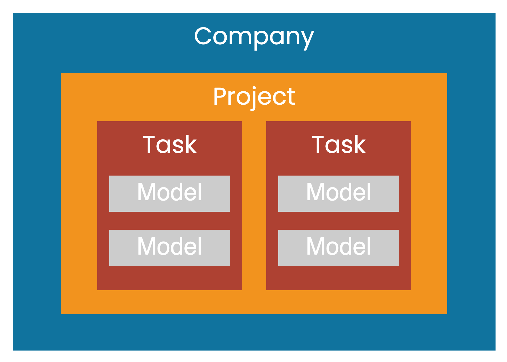
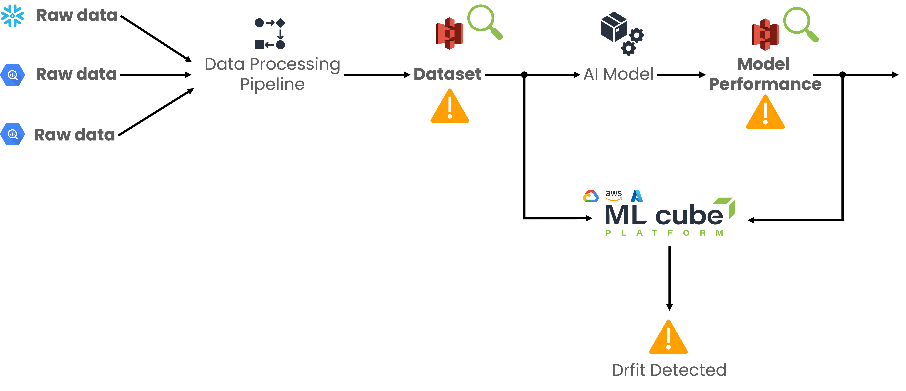

# Basic Concepts

In ML cube Platform, each User works in a Company that has a subscription plan and handles billing and payment method.

Inside a Company, a User can create Projects that contains AI Tasks. 
An AI Task is anything that involves an AI model that is used in production to provide outputs.
Examples are predicting sales forecast with a regression model, estimating fraud detection with classification model or customer segmentation with clustering algorithms.

ML cube suggests to put in a Project AI Tasks that either belong to the same domain, or shares data, or that are interrelated with each other.
That's why in a Project the User can see statistics or can do operations that involve its AI Tasks. 

<figure markdown>
  { width="400" }
  <figcaption>Structure of entities inside ML cube Platform.</figcaption>
</figure>

## Drift Detection
Drift detection is done at AI Task level.
A Task has a dataset composed of four categories of data:

- **metadata**: additional information that AI models do not use but are important to define the data or the samples.
Mandatory for this category are the `sample-id`, a unique identifier for each sample used to avoid confusion and misinterpretation; and the
`sample-timestamp`, a timestamp associated with each sample used for ordering.
Moreover, the User can provide additional data used to segment the data space. 
For instance, sensitive information like zip code or country are not used by AI models to prevent bias, however, ML cube Platform can use them to 
check and prevent bias in the suggested retraining dataset or to perform segmented drift detection.
- **input**: set of input features the AI model uses to predict the output. 
ML cube Platform uses the input data that come at the end of the processing data pipeline and not the raw data.
This is due to the fact that ML cube Platform detects drifts in what the AI model uses and not in the general data the customer has.
- **output**: target quantity predicted by the AI models.
It is present in the training data but can be not available for production data.
- **models' predictions**: predicted target for each AI model in the AI Task.

For each AI Task, ML cube Platform provides a set of Detectors that analyze different quantities of the Task.
**Data Detectors** are independent of the AI models inside the Task, and they check for input and concept drifts.
There is one **Model Detector** for each model in the task, a model detector analyses the model error to detect negative trends in its performance.

<figure markdown>
  { width="1000" }
  <figcaption>ML cube Platform in the ML inference pipeline.</figcaption>
</figure>

