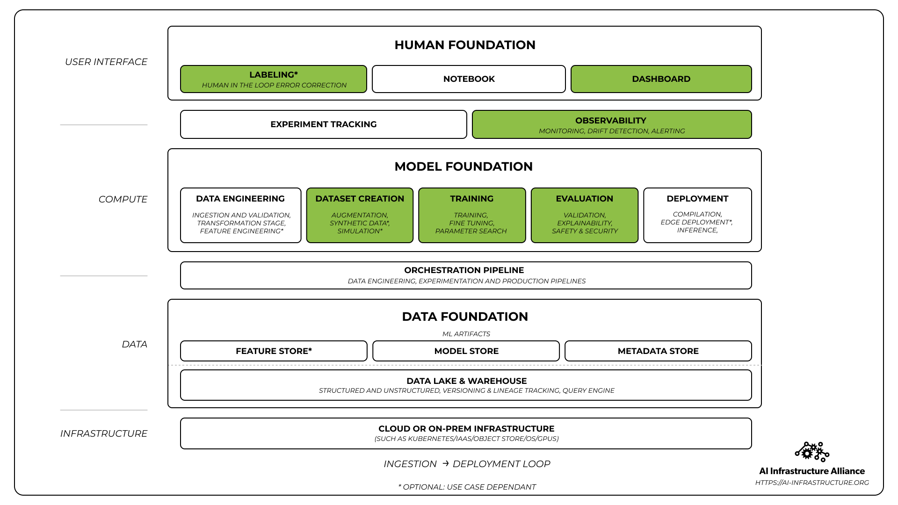

# User Guide

ML cube Platform is an MLOps tool focused on the serving stage of MLOps pipeline.
In particular, it is an AI Supervision tool that implements AI Monitoring and Observability 
to avoid AI's models obsolescence and performance degradation.

<figure markdown>
  { width="1000" }
  <figcaption>Covered Areas in the MLOps Stack.</figcaption>
</figure>
