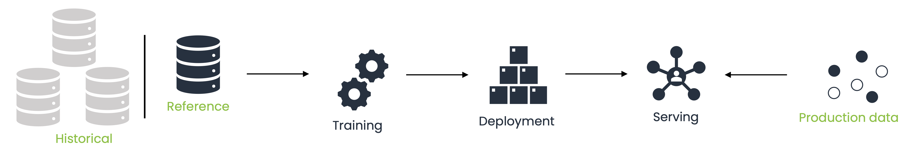

# Basic Concepts

This page provides an overview of the fundamental concepts in the ML Cube Platform, helping you familiarize yourself with the product.

## Company, Project, Task and Model

At the core of the ML Cube Platform is a **Company**. Upon registration, you create a Company, which comes with a **Subscription Plan** defining the number of Projects, Tasks, and Data you can manage. Billing and payments occur at the Company level.

<figure markdown>
  { width="500" }
  <figcaption>Structure of entities in ML Cube Platform.</figcaption>
</figure>

Once your Company is established, you, as the company owner, can create **Users** and assign them specific **Roles**.

> To help you to better understand the concepts and the entities in ML cube Platform we use a fictional company: it is called *Delta Energy*, and it is a producer of Photovoltaic Modules that own Photovoltaic fields and trades the energy to the market.

After the Company is created, you can create a **Project** and AI Tasks inside it.
Think of a Project as an application of Artificial Intelligence algorithms and techniques to optimize a KPI.

> *Delta Energy*, for instance, created the *Energy Revenue* Project to enhance their revenue from energy trading.
> They invested in four AI algorithms:
> 
> 1. Fault detection
> 2. Fault diagnosis
> 3. Soiling detection
> 4. Trading

> In ML cube Platform, these four algorithms define four Tasks inside the Project *Energy Revenue*.
> They have been placed into the same Project because they share the business goal i.e., the net revenue,
> the data and are interdependent.

Putting Tasks inside the same Project allows to leverage Tasks and data correlation having a comprehensive view of the problem.

As you may have guessed, in ML cube Platform a **Task** corresponds to an AI Algorithm.
To be more precise, a Task is an AI Problem with a dataset composed of input features and a target.
A Task can have more than one AI Model that uses the input features estimates the target.

> In out example company, the Fault Detection Task has as input features the PV moduels and weather data and the target is the presence of a fault.
> The Task has two Models: logistic regression and random forest.
> Both models use the same data and predict the same target but are different in the techniques used to perform the estimation.

The last entity is the **Model** that is the actual AI model that predicts the target.
A Model has a Version that defines the training data used to train it.
All model's data will be uploaded specifying the model version in order to track each prediction with the right model instance.
The model version is updated whenever a new training of the model is done.

It's worth nothing to note that in ML cube Platform you do not actually need to upload the model on the application.
We just need to know its training data and its predictions for the production data.
In this way, ML cube Platform is considered as *model agnostic*.

## Data Taxonomy
A Batch of data is composed of four types of data:

- **metadata:** additional information that AI models do not use as input but that is important to define the data or the samples.
Mandatory for this category are the `sample-id`, a unique identifier for each sample used to avoid confusion and misinterpretation; and the
`sample-timestamp`, a timestamp associated with each sample used for ordering.
Moreover, the User can provide additional data used to segment the data space. 
For instance, sensitive information like zip code or country are not used by AI models to prevent bias, however, ML cube Platform can use them to 
check and prevent bias in the suggested retraining dataset or to perform segmented drift detection.
- **input:** set of input features the AI model uses to predict the output. 
ML cube Platform uses the input data that comes at the end of the processing data pipeline and not the raw data.
This is due to the fact that ML cube Platform detects drifts in what the AI model uses and not in the general data the customer has.
- **output:** target quantity predicted by the AI models.
It is present in the training data but can be not available for production data.
- **models' predictions:** predicted target for each AI model in the AI Task.

### Data Categories
ML cube Platform are present three categories of data:

- **Reference:** represents the dataset used to train the model.
Each model version has a reference dataset.
Detection algorithms use reference data during their initialization.
- **Production:** represents data that comes from the production environment in which the AI model is operating.
Detection algorithms analise production data to detect the presence of drifts.
- **Historical:** represents additional data that ML cube Platform can use to define the retraining dataset after a drift.

<figure markdown>
  { width="1000" }
  <figcaption>ML cube Platform data categories.</figcaption>
</figure>

> Delta Energy company trained its models using the data in the year 2022 and used the algorithms starting from the 2023.
> This means that the data in the 2022 are the reference data and every data from the january first 2023 are considered as production data.
> Data previous 2022 are historical data instead.

## User Roles
Before to dive into details about the functionalities and modules covered, let's talk about the Role Based Access Control in ML cube Platform.
As mentioned above, the company owner can create new Users assigning to them a Role.
See the [Roles](rbac.md) page to read more about it.
The Role defines the set of actions a User has inside the ML cube Platform.
There are two levels of roles:

-  **Company:** each User has a role inside the company. 
The roles are Owner, Admin, Standard User.
- **Project:** by default a User does not have roles in a Project. 
The Company Owner or Admin will assign a Project Role to User when needed.
The roles are Admin, Edit User, View User.

<figure markdown>
  { width="500" }
  <figcaption>User Roles in ML cube Platform.</figcaption>
</figure>

> Delta Energy has one dedicatd AI Team to each Task. 
> Hence, they assigned specific Project Administrator Role to each Team leader; while
> the other Data Scientists have the Project Edit Role for the project they are working on.

## Drift Detection
ML cube Platform provides a set of Detectors for each AI Task. These detectors are used to monitor the task according 
to different levels. The choice over the types of detectors to be instantiated depends on the type of task (classification or regression) and on 
the type of data available for that task (input, output, model predictions).   
There are mainly two classes of detectors:  

- **Data Detectors:** they take into account data associated with the task. They may be *input only* 
data or *input and ground truth* data. These detectors are independent from the models trained on the 
task as they do not either consider their predictions or performances. These detectors are responsible for the identification of 
input and concept drifts. According to the type of the used detector, changes in data are either monitored at feature 
level or using a multivariate monitoring strategy.
- **Model Detectors:** they monitor the performances associated with the models related to the task.
In cases where the user has multiple models trained for a single task, a single detector is created for each model.

Each detector is initially created using **Reference data** provided by the user. Every time a new batch of data 
is uploaded, the detectors observe the batch and update their statistics.  
Each detector updates its statistics independently from the others and each of them presents a double-level alarm scheme in 
order to either signal a **Warning** or a **Drift** for the monitored task. Each of these levels are identified by properly 
setting specific thresholds for each detector. The choice over the sensibility associated with the alarms can be chosen 
by the user.  
The detectors may be in three different states: 

- **Regular:** the detector is monitoring data that are similar to the reference data, 
- **Warning:** the detector has fired a Warning alarm since the data has started to change. From this zone, it is possible 
to either go into the Drift status or to go back to the Regular one, depending on the monitored data.
- **Drift:** the detector has fired a Drift alarm and a change has been established between the reference data and the last 
ones. After a drift, the detector is usually reset by defining a new set of reference data. The reset process is different 
according to what has been monitored by the detector.  
<When a detector 
enters the warning zone, it generates a warning alert. It is possible to exit from the it if the new data gets more similar 
to the reference data. If instead, data exhibit significant differences with respect to the original ones, the detectors 
may enter the drift zone and fire a drift alarm.>

All the alarms generated during this process are combined and a final set of alarms is shown to the user. The alarms generated 
during this process will be helpful to define the division into **Concepts**.
<After having raised drift alarms, the detectors can be reset in different ways, according to what the detector is actually monitoring.>

## Retraining
A Data drift determines a drop in the model's performance that starts providing bad estimation or predictions.
In Artificial Intelligence, Data plays a crucial role and usually, choosing the best data has higher impact in the resulting Model quality with respect to increasing the model complexity.

ML cube Platform with its Retraining Tool Module provides you the best retraining dataset to use when updating the Model after a drift reducing the reaction time after the detection.
Even if, the data has changed you can extract useful information from the past.
ML cube Platform leverages all the available data belonging to the three categories: histrical, reference and production, computing an Importance Score to every data sample you have.
These Importance Scores will be used during the training phase of your model as weights in the loss function.

## Model Life Cycle
ML cube Platform covers all the aspects of the *post-deployment life cycle* of your AI models:
<figure markdown>
  { width="500" }
  <figcaption>Post-deployment AI model life cycle.</figcaption>
</figure>

> In Delta Energy data are collected every minute and are sent simultaneously to ML cube Platform.
> Ground truth data like the presence of a fault and the fault category are uploaded after they are available and therefore, they will sent with a delay compared the others.

> Drift alerting system is integrated with their Microsoft Teams and ML cube Platform sends alerts to the specified channels.
> After they receive an alerting message, they run a retraining pipeline that communicated with ML cube Platform to retrieve the retraining dataset to use.
> After that, they are ready to update the new version on ML cube Platform to start the monitoring.
