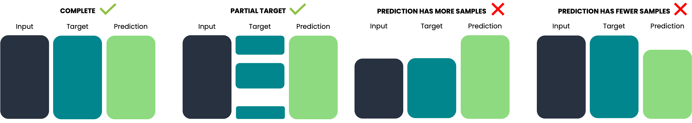
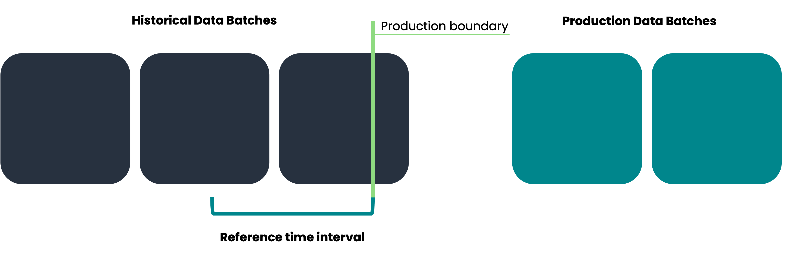
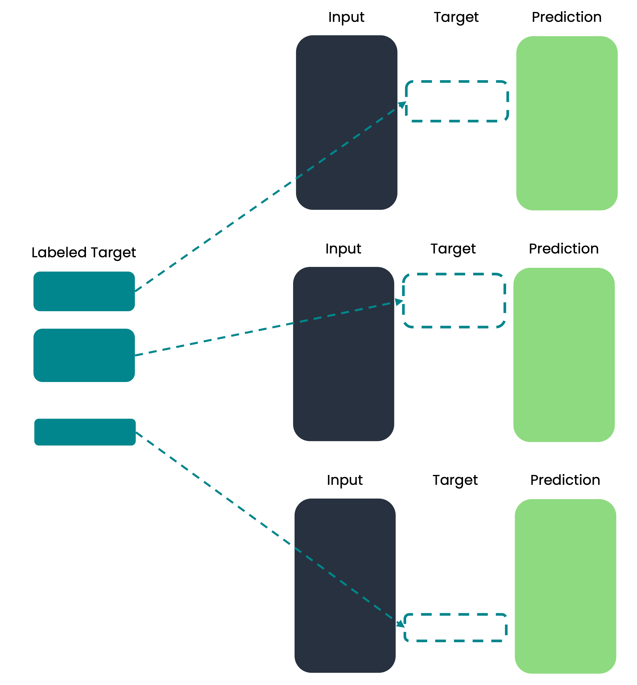

# Data

To use ML cube Platform, you need to upload the data that your artificial intelligence algorithms deal with.
They are represented by the _Data_ logical entity, which is a complex object composed of many different elementary units.

According to the context, the Data object has some required entities to be considered valid: for instance, training data require both input and target, while production data are still valid with only inputs.

Each elementary unit in the Data object belongs to a _Data Category_, which represents an consistent group of data.
Available categories are:

| Data Category | Description |
| ------------- | ----|
| Input | The set of input data like features in Tabular Task or the Image in Object Detection Task. |
| Target | The ground truth data representing the actual class in a Classification Task or the value to predict in Regression. |
| Prediction | The AI model's prediction using the Input data. |

## Data Category and Data Schema Column's Role

The [Data Schema] created for the [Task] contains a list of Column objects, each of which has a _Role_.
Naturally, there is a relationship between the Column's Role and the Data Category.
In fact, each Data Category comprises a set of Column objects with certain Roles.
When you upload samples belonging to a Data Category, they must contain all the Columns objects declared on the Data Schema to be considered valid.

The following table shows these relationships:

| Data Category | ID | Time ID | Input | Input additional embedding | Target  | Target additional embedding | Prediction | Prediction additional embedding |
| -- | -- | -- | -- | -- | -- | -- | -- | -- |
| Input | :material-check: | :material-check: | :material-check: | :material-check: | :material-close: | :material-close: | :material-close: | :material-close: | :material-close: |
| Target | :material-check: | :material-check: | :material-close: | :material-close: | :material-check: | :material-check: | :material-close: | :material-close: | :material-close: |
| Prediction | :material-check: | :material-check: | :material-close: | :material-close: | :material-close: | :material-close: | :material-check: | :material-check: | :material-close: |

!!! note
    As you can see Column's Roles ID and Time Id are always required because are used by ML cube Platform to correctly link data units together.

!!! example
    Consider a regression task with three inputs variables $X_0, X_1$ and $X_2$.
    In the Data Schema they are represented by three Column objects with Input Role.
    When uploading Input Data Category, the csv file must contain the three Input Columns, the Time ID and the ID like:
    ``` csv
    sample_id,time_id,x_0,x_1,x_2
    abc123,1234,3.5,100,23.0
    ```

## Data Batch

ML cube Platform supports batch-based data processing, which means that data samples are uploaded together as a batch.
Therefore, the Data object described above must contain, for each Data Category, the same set of samples to form a consistent batch.
The only exception is for Target data that, given the fact that they may be obtained through labeling, can be present partially.

!!! warning
    Even if Target data can be uploaded partially, they must be a subset of samples of Input or Prediction.

In any case, the presence of a Data Category in a Data Batch depends on the context in which it is uploaded.
In the next section we explain what is meant by the _Historical_, _Reference_ and _Production_ data.

!!! info
    You can see your uploaded data batches in its own page.
    With information about the origin of data, the data categories it contains and what monitoring has been done.

<figure markdown>
  
  <figcaption>Examples of two valid and two invalid data batches.</figcaption>
</figure>

## Data contexts

Data samples have different meanings depending on how you have used them to train, validate, or infer from your artificial intelligence model.
Some data may be too old and, therefore, not used, others may belong to a training set, and, lastly, the newest one comes directly from production.

To handle all these scenarios, the ML cube Platform allows the upload of data specifying how they were used.
Indeed, the operations of the ML cube Platform will be different to each context.

The main difference in the data usage is the split between the ones present before the model was in production and the others.
For that reason, the ML cube Platform defines two data contexts: _historical_ and _production_.

!!! note
    Note that when an artificial intelligence model is retrained with new data, the previous contexts change and the old production data become historical ones for the new model version.

<figure markdown>
  { width="900" }
  <figcaption>Different data batches and they data context.</figcaption>
</figure>

### Historical

Historical data are all data samples that existed before the model was deployed in production.
They include the training, validation and test sets that were used during model experimentation and training, or older data that were discarded.

Historical data can be uploaded in ML cube Platform anytime through different data batches.

Data categories that a batch of historical data contains depend on the Task Type, here is the summary:

- Supervised tasks like regression, classification and object detection requires Input and Target
- Retrieval Augmented Generation task requires Inputs and Predictions

The reason why it is not possible to upload the model's predictions in historical data of supervised tasks is that they may contain the training bias of the model.
On the other hand, in RAG tasks there is no target or training dataset.

??? code-block "SDK Example"

    You can upload historical data as follow:

    ``` py
    job_id = client.add_historical_data(
        task_id=task_id,
        inputs=inputs_data,
        target=target_data,
    )
    ```

#### Reference

As mentioned before, to historical data belong to both training and old data, but it is important distinguish them.
The [Monitoring] module requires the definition of a Reference dataset representing training, validation and test data.
The reference data is initially loaded as historical data and then marked as reference data by providing the timestamp interval.

It is worth mentioning that also RAG Tasks can have reference data even if they do not have a proper training dataset.
Indeed, reference data are used by the Monitoring module to initialize drift detection algorithms, therefore, the reference data definition is a mandatory step to enable this feature.
For RAG Tasks, reference data can be used to indicate the type of data expected in production.

!!! warning
    There is only one limitation to upload historical data: the __production boundary__.
    Model data reference defines a rigid boundary separating historical and production data.
    This boundary is defined as the last sample timestamp of the reference data.
    After the model data reference is defined, it is no longer possible to upload historical data that are more recent than that date.
    Indeed, data with sample timestamps higher than the production boundary are considered production data and no longer historical.

??? code-block "SDK Example"

    You can set reference data as follow:

    ``` py
    job_id = client.set_model_reference(
        model_id=model_id,
        from_timestamp=from_timestamp,
        to_timestamp=to_timestamp,
    )
    ```

### Production

After the artificial intelligence model is deployed in a production environment, incoming data belongs to the Production context.
They have different characteristics with respect to historical data because they are online.

While the assumption for historical data is that they belong to the past and are complete (with both input and target as an example), production data can be partial or different Data Categories are available at different times.
For that reason, they can be uploaded asynchronously at different moments in time.

However, there are some constraints about the Production data upload.
Since data samples are grouped in Data Batches they must be consistent in all the Data Categories.
ML cube Platform allows to upload each category separately at different moments but the uploads must contains always the samples in the Data Batch.

!!! info
    After data are uploaded to ML cube Platform their ID are analyzed to determine if they are already present or not.
    If not then a new Data Batch is created containing the set of samples ID just uploaded.
    If the samples are already present in ML cube Platform they belong to a existing Data Batch and the Data Category is attached to it.

Let's do an example with a Regression Task about forecasting the weekly produced power from a solar plant.
In this case, inputs come from electrical and meteorological measurements from the past week and are immediately available; prediction is available as soon as the model makes an inference and is uploaded from the model inference service.
Instead, target data are only available at the end of the week.

- Input samples are the first uploaded Data Category and they define the samples that belong to this Data Batch.
- Predictions are uploaded after the model inference is completed, in order to be valid they must match entirely the input samples already uploaded.
- Target data are uploaded at the end of the week and, as described before they can be a subset of already uploaded input samples.

??? code-block "SDK Example"

    You can upload production data in one method call:

    ``` py
    job_id = client.add_production_data(
        task_id=task_id,
        inputs=inputs_data,
        target=target_data,
        predictions=[
            (
                model_id,
                prediction_data,
            )
        ],
    )
    ```

    or in different times:

    ``` py
    job_id = client.add_production_data(
        task_id=task_id,
        inputs=inputs_data,
        target=None,
        predictions=None
    )
    # ...
    job_id = client.add_production_data(
        task_id=task_id,
        inputs=None,
        target=target_data,
        predictions=[
            (
                model_id,
                prediction_data,
            )
        ],
    )
    ```

### Post labeling

In some use cases, target data are obtained only by human labeling, and since this is an expensive procedure, not all available samples are labelled but usually only a selected subset.
Moreover, it is possible that labeling is done occasionally for samples that belong to different data batches uploaded in ML cube Platform.

Obviously, this scenario does not belong either to historical or production contexts and it has its own specificity.
Hence, ML cube Platform provides another way to upload newly labelled samples in a single moment.
In this case, there are no constraints about data batches or production boundary but you are allowed to upload all data freely.
ML cube Platform will take care of assigning the new target to the right Data Batch.

!!! warning
    The only constraint is that you cannot upload the label for a sample that already has target uploaded.

<figure markdown>
  { width="500" }
  <figcaption>Labelled target data distributed in their data batches.</figcaption>
</figure>

??? code-block "SDK Example"

    You can upload labelled target samples via the add_target_data method:

    ``` py
    job_id = client.add_target_data(
        task_id=task_id,
        target=target_data,
    )
    ```

## Data sources

The previous sections of this page described what a Data object is, how it is represented by Data Batch and its uploading contexts.
To have more information about how to actually upload data we suggest to read the page [Data Sources].


[Task]: task.md
[Data schema]: data_schema.md
[Monitoring]: modules/monitoring.md
[Data Sources]: integrations/data_sources.md