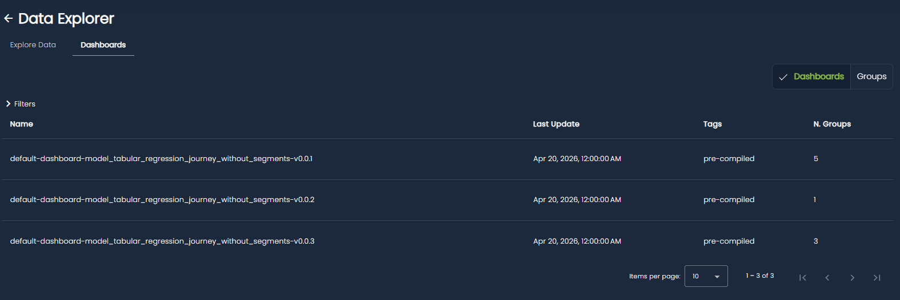
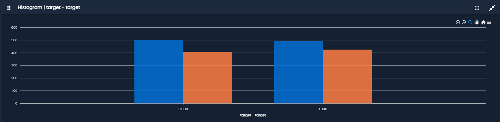
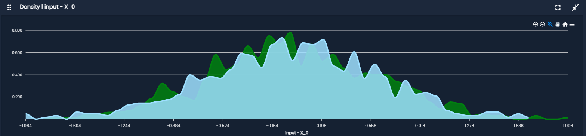
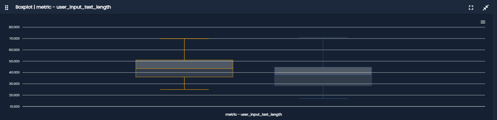
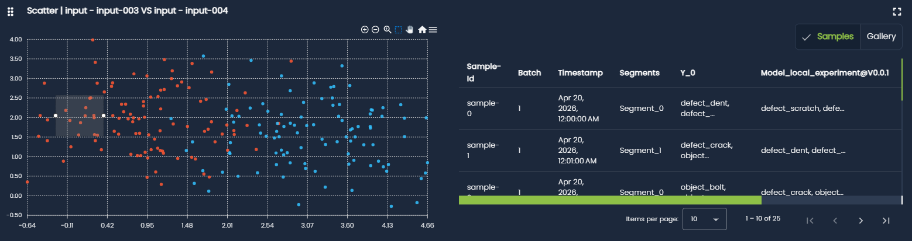
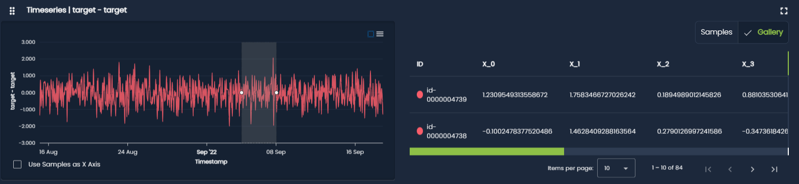

# Dashboards

The Dashboards section of the Data Explorer provides a set of visualizations designed to help you understand the statistical properties and evolution of your data.

It enables exploratory analysis through univariate, bivariate, and time series plots, offering insights into feature distributions, relationships, and trends over time.

<figure markdown="span" style="display: inline-block; text-align: center; width: 100%;">
  
</figure>

## Entities

Dashboard visualizations are built around different types of entities, representing the various components of your ML pipeline:

- **Input**: model input features
- **Target**: ground truth labels
- **Prediction**: model outputs
- **Metric**: metrics computed on other entities
- **Performance**: aggregated performance indicators

These entities define what is being visualized in each plot and allow you to analyze both data and model behavior.

## Data Groups

Dashboards operate on **data groups**, which represent subsets of data defined through filtering conditions. They provide a structured way to isolate, organize, and compare different portions of a dataset within the same visualization (e.g., reference vs production batches).

A data group is defined using three filtering dimensions:

- **Time range**: selects data within a specific temporal window, enabling analysis of behavior over a defined period.
- **Batch index**: filters data based on processing batches, useful for comparing complete data batches.
- **Segments**: partitions data into logical or categorical subsets defined by the user.

Each data group also carries metadata used for visualization and identification:

- A **name**, which uniquely identifies the group within the dashboard and improves readability in plots.
- A **color**, used consistently across all visualizations to visually distinguish groups.
- A set of **tags**, which provide flexible labels for custom grouping, filtering, and organization across the dashboard.

Together, these components allow data groups to act as a unified abstraction for comparing different slices of data in a consistent and interpretable way.

## Plot Types

Dashboards support three main types of plots:

### Univariate Plots

Visualize a single entity:

- **Histogram**: shows the **frequency distribution** of a single variable by grouping values into bins.  
It helps identify the overall shape of the distribution (normal, skewed, etc.) and concentration of values.

<figure markdown="span" style="display: inline-block; text-align: center; width: 100%;">
  
</figure>

- **Density Plot**: is a **smoothed version of a histogram** that estimates the probability distribution of a variable.  
It is useful for, understanding distribution shape without binning effects, comparing multiple distributions smoothly and detecting skewness or multimodality.

<figure markdown="span" style="display: inline-block; text-align: center; width: 100%;">
  
</figure>

- **BoxPlot**: summarizes a distribution using **quartiles and outliers**. 
It shows, median (central value), interquartile range (IQR), potential outliers and overall spread and asymmetry
It is particularly useful for quick comparison between groups.

<figure markdown="span" style="display: inline-block; text-align: center; width: 100%;">
  
</figure>

### Bivariate Plots

Visualize relationships between two entities:

- **2D scatter plot**: displays individual data points in a coordinate system using two variables (x and y). It helps to, visualize relationships or correlations, identify clusters or group structures, detect trends, nonlinear patterns, and outliers.

<figure markdown="span" style="display: inline-block; text-align: center; width: 100%;">
  
</figure>

### Time Series Plots

Time series plots show how a variable evolves over time.

They are used to, track trends and seasonality, detect sudden changes or anomalies, monitor drift in systems or metrics over time and analyze temporal patterns and stability.

<figure markdown="span" style="display: inline-block; text-align: center; width: 100%;">
  
</figure>

## Dashboard Structure

A dashboard is composed of:

- A set of **plots**, each configured with:

    - Plot type (univariate, bivariate, time series)
    - Associated entities
    - Visualization settings (e.g., expanded state)

- A set of **data groups**, which are applied across all plots

The interaction between plots and data groups is key:

- Each plot is computed **for every data group**
- Data groups are visually distinguished (e.g., by color)
- This enables direct comparison of distributions and metrics across different subsets of data

## Automatic Configuration

Dashboards are automatically generated and configured by the platform:

- A new dashboard is created whenever a new reference is set
- Data groups are automatically created for:
    - each new reference
    - each new production data batch uploaded
- The set of plots is selected based on:
    - Task type
    - Data structure (tabular, image, text)

This ensures that relevant visualizations are available without manual setup.

!!! warning
    At the moment, dashboards are **fully precomputed and automatically managed** by the platform:

    - Data groups cannot be manually created or modified (except for the color)
    - Dashboards are generated only during reference updates

    This first version ensures consistency and ease of use, while future iterations may introduce more flexibility and user-defined configurations.