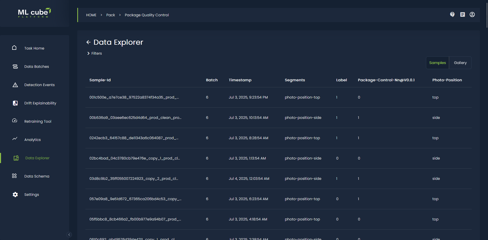
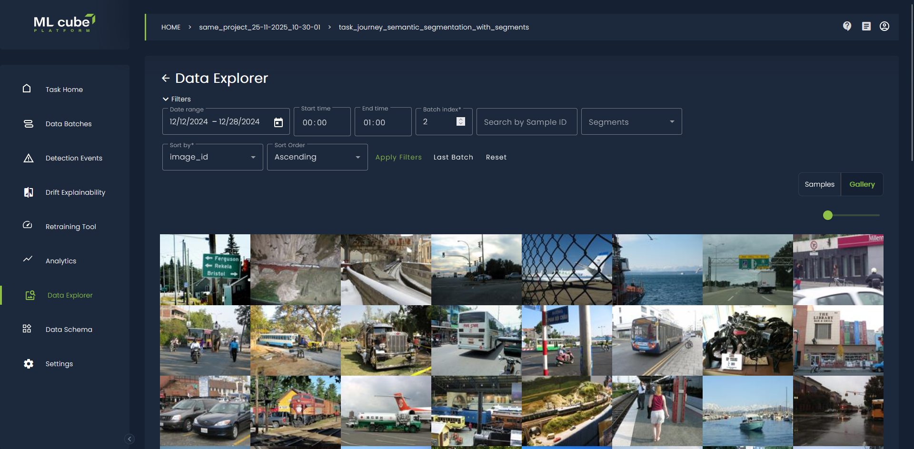
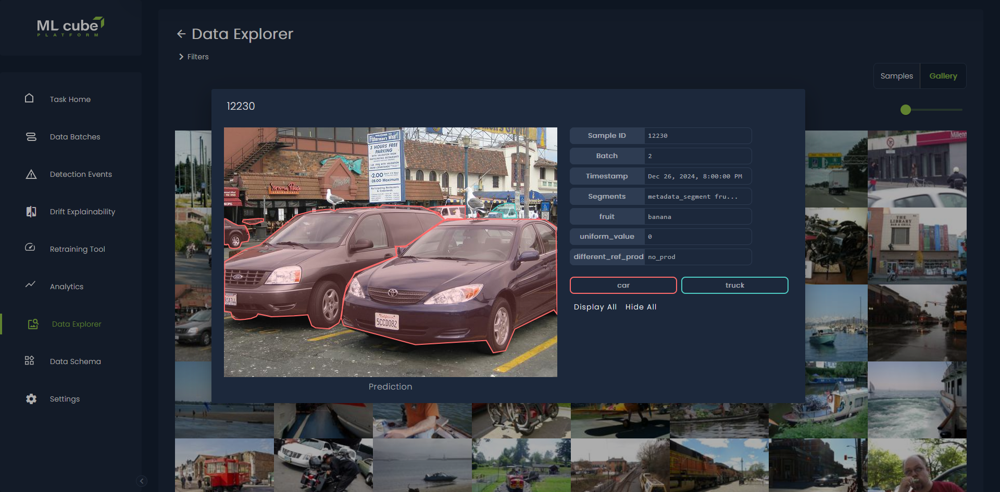
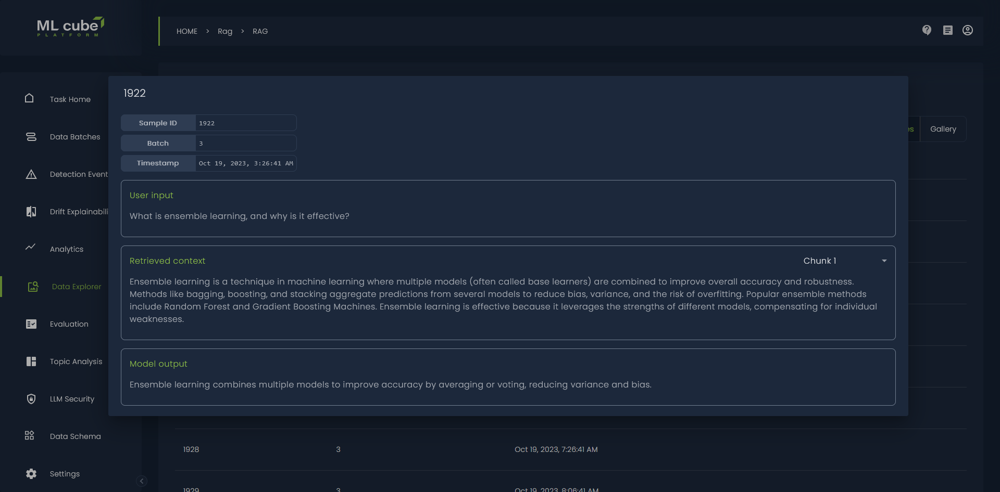

# Explore Data

The Data Explorer offers two main ways to visualize your data:

*   **Sample View:** This view presents your data in a paginated table, showing key information for each sample, such as its metadata and any associated predictions or drift scores. You can click on a row to open a view with more detailed information about that specific sample.

<figure markdown="span" style="display: inline-block; text-align: center; width: 100%;">
  
</figure>

*   **Gallery View:** The Gallery View provides a more intuitive way to browse your actual data. For tabular data, the table displays the features used by your model, images are displayed as a grid of thumbnails, and text data is shown as a series of cards. You can adjust the size of the images in the gallery to see more or fewer items at a glance.

<figure markdown="span" style="display: inline-block; text-align: center; width: 100%;">
  
</figure>

### Filtering and Sorting

To help you find the data you're interested in, the Data Explorer provides a rich set of filtering options. You can filter your data by:

*   Date and time range
*   Batch index
*   Sample ID
*   Segments

You can also sort the data by any property that is not a list.
Filters are automatically set to the latest data batch available in your task, and can be reset or cleared as needed.

### Detailed Sample Exploration

When you click on a sample, a modal pops up, showing you all the available details for that sample. This includes:

*   **Tabular Data:** A detailed view of all the features.
*   **Images:** The full-resolution image. For object detection and semantic segmentation tasks, this also includes overlays on top of the prediction, target, or both.
   
<figure markdown="span" style="display: inline-block; text-align: center; width: 100%;">
  
</figure>

*   **Text:** The full text, and in the case of RAG (Retrieval-Augmented Generation) tasks, the user input, retrieved chunks, and model output. Any markdown syntax in the text is automatically rendered for better visual clarity.

<figure markdown="span" style="display: inline-block; text-align: center; width: 100%;">
  
</figure>