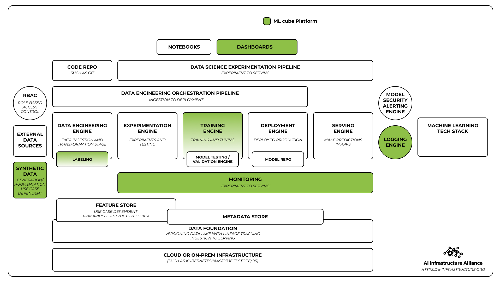
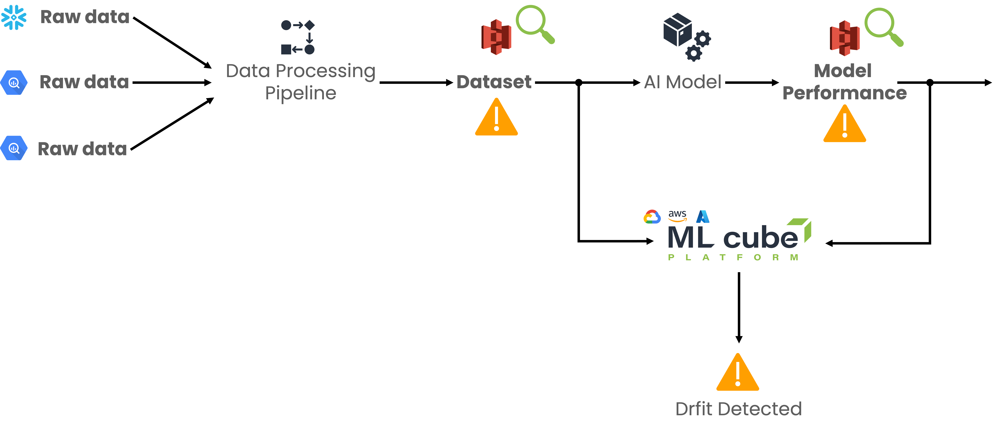

# User Guide

ML cube Platform is an MLOps tool in the *Serving Stage* of MLOps pipeline.
It is an AI Supervision tool that implements Monitoring and Observability to avoid AI's models obsolescence and performance degradation.

In the Figure below are depicted the covered areas by ML cube Platform:
<figure markdown>
  { width="1000" }
  <figcaption>Covered Areas in the MLOps Stack.</figcaption>
</figure>

With ML cube Platform you can:

- log inference data and identify the presence of drifts;
- obtain the best retraining dataset to update your model after a drift;
- have a business perspective on your AI Tasks to link your KPIs with AI models' performance
- apply expert learning techniques during inference to mitigate the problems due to changes in the data;
- use relabeling module to obtain the most important samples to relabel.

## Artificial Intelligence applications monitoring
AI monitoring consists of applying detection algorithms to metrics that comes from an Artificial Intelligence system.
The monitored metrics are split in two categories:

- **Serving metrics:** quantities related to the infrastructure and the software application like inference time and network rate;
- **AI metrics:** quantities related to the Artificial Intelligence application like model performance, missing values and data distributions.
 
ML cube Platform focuses on AI metrics, its goal is to monitor data and AI models to detect drifts and AI related problems and to provide actions that keep model performance high.
 
## Data and model monitoring
ML cube Platform implements data monitoring and model monitoring. 
Model monitoring detects drifts and problems in the monitored AI model.
Model monitoring means analyzing its performance metric (like RMSE, precision, or any custom performance metric) over time to detect deviations and negative trends before they will be problematic.
Whenever a drift in the model performance is detected, an alarm is raised because the model needs to be updated with a new training data.
 
Data monitoring processes the input and the ground truth.
Detectors that monitor only the input check for input drift, i.e., a change in $P(X)$ distribution, while detectors that monitor both input and ground truth check for concept drift i.e., change in $P(y | X)$ distribution.
 
Model and data monitoring are related and interdependent since the presence of a concept drift usually determines a model drift as well.
They are used simultaneously to improve the overall detection quality.
 
## What do you need to log on ML cube Platform?
ML cube Platform's detection algorithms works at model level.
Therefore, uploaded *input data* are the numeric features the model model receives as input to make inferece.
Those data are the ones at the end of the data processing pipeline after the cleaning, feature extraction and normalization.

<figure markdown>
  { width="1000" }
  <figcaption>ML cube Platform in the ML inference pipeline.</figcaption>
</figure>

## Creating a baseline with Reference Data
Reference data are part of the datasets used during the development of the AI model: they contain training, validation, and test sets, i.e., anything the AI model saw during its training phase.
Reference data are used to initialize data detectors calibrating them to what the model learnt.
 
Reference data are not used to initialize the model detectors since the error on training set is not fair with respect the error with external data.
Therefore, model detectors initialize themselves with production data assuming that the performance the AI model has in the first timesteps after the deployment belong to the same data distribution.
 
## Improving retraining quality with Historical Data
Historical data are composed of any dataset the customer has that were not used to train the AI model that is used in production (they potentially can be old training datasets of old models).
Historical data are not used during the drift detection phase but during the retraining dataset selection phase.
They are not mandatory, but their availability increase the quality and the information of the retraining dataset ML cube Platform provides to the customer.
Indeed, ML cube Platform will use all the information available to provide the best dataset for retraining. 
The historical data have the same format as the input data, therefore, they are data after the data processing pipeline.
 
## What is a retraining dataset?
When a drift occurs, the AI model performance decreases.
The retraining dataset is the new dataset ML cube Platform provides to the customer that should be used to retrain the AI model in order to increase the AI model performance.
Conceptually, the retraining dataset is composed of the production data after the data drift with all the data that are similar to them.
What ML cube Platform provides is a set of importance weights, one for each data sample belonging to the three data categories: historical, reference, production.
The magnitude of the importance weights indicates how much the single sample is important for the current retraining.
The customer integrates the weights in the training procedure using a weighted loss function.
If the AI model does not support weighted loss function, ML cube Platform can provide a list of sample ids to use as training dataset.