# Retrain Trigger

This section offers an overview of how you can set up a retrain trigger for your model. 
Retrain triggers enable the automatic initiation of your retraining pipeline from the ML cube Platform. They are designed as 
integrations with external services and thus require credentials with the appropriate privileges to be executed.

A Retrain Trigger can be utilized within a [Detection Event Rule](../monitoring/detection_event_rules.md). Alternatively,
it can be manually activated from the WebApp, in the Retraining section.

## Supported Triggers

The following retrain triggers are supported:

- `Amazon EventBridge`: puts an event in an Event Bus.
- `GCP Pub/Sub`: puts an event in a Pub/Sub Topic.
- `Azure Event Grid`: puts an event in an Event Grid Topic.

=== "Amazon EventBridge"
    {: style="height:50px;width:50px"}

    If your MLOps pipelines are set up in the AWS ecosystem, then you probably need the Amazon EventBridge retrain trigger.

    The trigger, when activated, will create an event in a Event Bus of your AWS account with custom metadata.

    You need to create an Event Bus rule that recognizes the ML cube Platform event pattern and attach the target action you want.
    Examples of targets are:

    - launching a Lambda function;
    - launching a SageMaker pipeline;
    - sending a message to a SQS Queue with a retraining request.

    #### Event Bus Setup

    1. In the AWS console, open the Amazon EventBridge service and select the `Event buses` option in the left-side menu
        <figure markdown>
        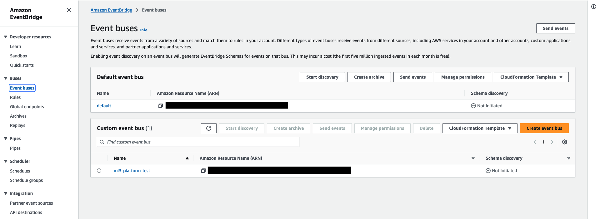{ width="800" }
        </figure>

    2. In the `Custom event bus` tab, create a new event bus with the default settings

    3. Select the `Rules` section on the left-side menu and click the `Create Rule` button
        <figure markdown>
        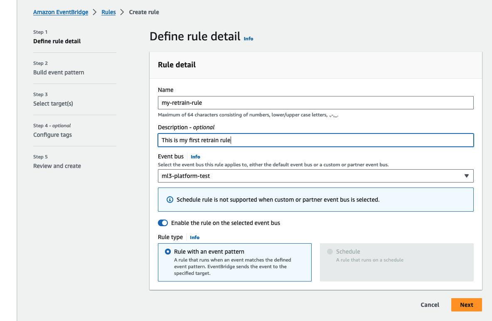{ width="800" }
        </figure>

    4. Insert the rule name and the created Event Bus in the Event Bus section. Click `Next`
        1. `Event source`: select the voice *AWS events or EventBridge partner events*
        <figure markdown>
        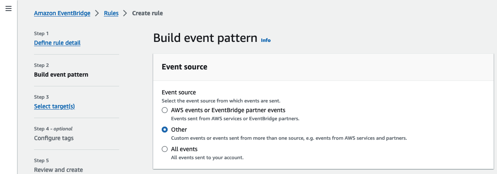{ width="800" }
        </figure>
        2. `Sample event`: copy and paste this:
    ```json
    {
        "version": "0",
        "id": "fcdd87c7-f56e-c722-4f85-4cb6ba85a00a",
        "detail-type": "retrain_trigger",
        "source": "ml3_platform",
        "account": "123456789",
        "time": "2023-11-02T14:16:23Z",
        "region": "eu-west-3",
        "resources": [],
        "detail": {
            "first_param": "hi",
            "second_param": "bye"
        }
    }
    ```
        <figure markdown>
        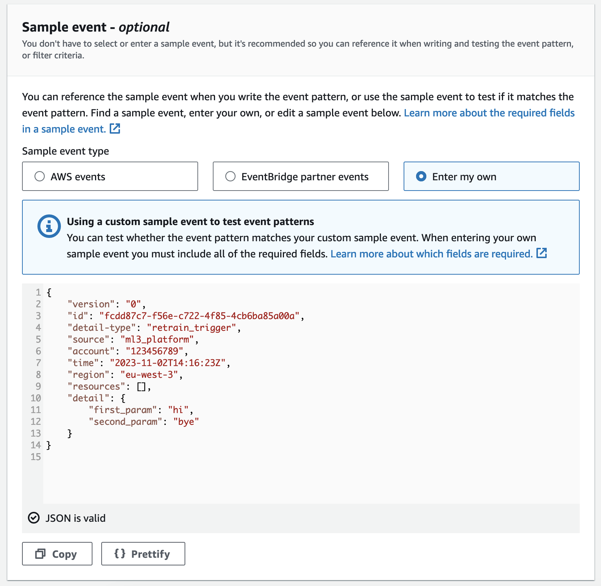{ width="800" }
        </figure>
        3. `Creation method`: select Custom pattern (JSON editor)
        <figure markdown>
        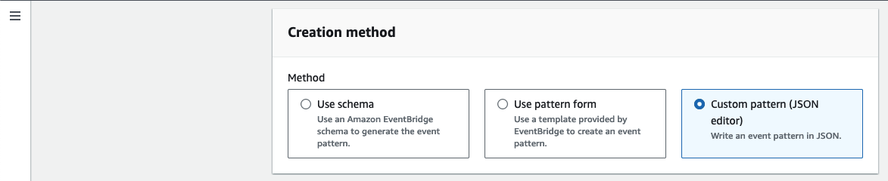{ width="800" }
        </figure>
        4. `Event pattern`: copy and paste this:
        <figure markdown>
        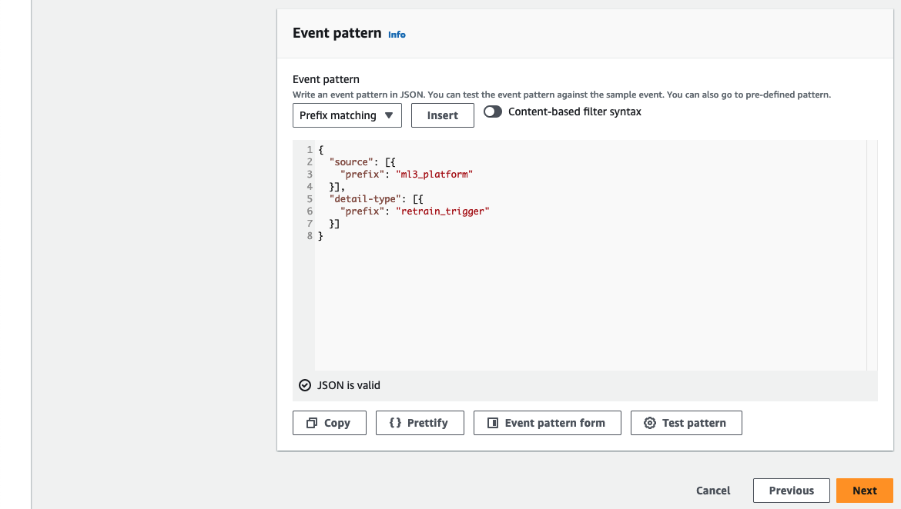{ width="800" }
        </figure>
        ```json
        {
            "source": [{
                "prefix": "ml3_platform"
            }],
            "detail-type": [{
                "prefix": "retrain_trigger"
            }]
        }
        ```
        5. click the button Test pattern to check the match and then click next

    5. Select the target that will handle the events. If you want to test the rule, you can add a CloudWatch target that stores the event to a new Log Group.
        <figure markdown>
        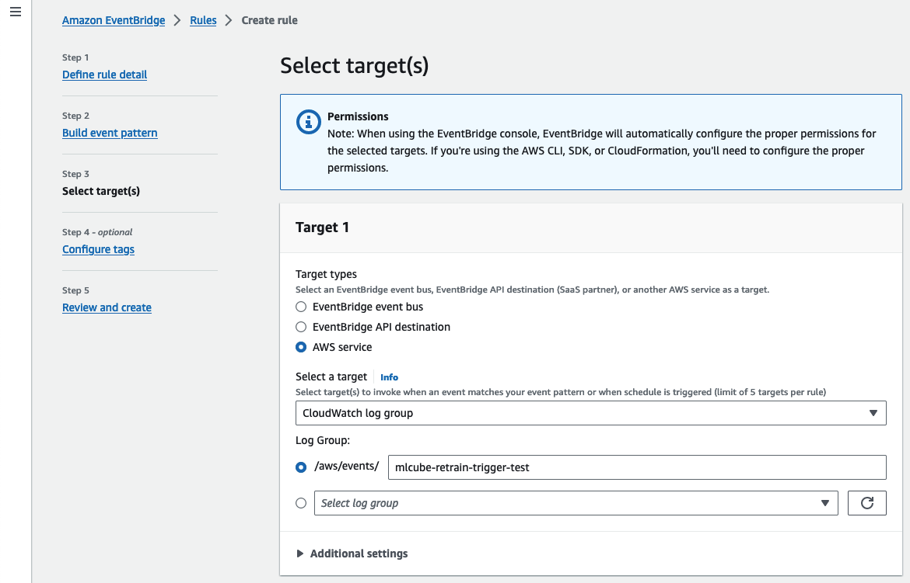{ width="800" }
        </figure>

    6. Create the rule

    **Retrain Trigger Setup**
        
    To integrate Amazon Event Bridge, you need to create a set of AWS credentials, and add a policy that allows to put events in 
    your event bus. Please refer to [this page](index.md) for more information.

    Once the credentials and the policy have been created, you can set up the retrain trigger for your model through the SDK 
    or the web application.

    ??? code-block "SDK Example"
        
        Here is an example of how to set up an AWS Event Bridge Retrain Trigger using the SDK:

        ```py
        client.set_retrain_trigger(
            model_id='your_model_id',
            trigger=AWSEventBridgeRetrainTrigger(
                credentials_id='your_credentials_id',
                aws_region_name='e.g. eu-west-3',
                event_bus_name='your_event_bus',
            ),
        )
        ```

=== "Google Cloud Platform"
    {: style="height:50px;width:50px"}

    If your MLOps pipelines are set up in the Google Cloud Platform ecosystem, then you probably need the GCP Pub/Sub retrain trigger.

    The trigger, when activated, will create an event in a Pub/Sub topic of your GCP project with custom metadata.

    #### Topic Setup

    1. In the Google Cloud console, open the Pub/Sub service and select the `Topics` option in the left-side menu
        <figure markdown>
        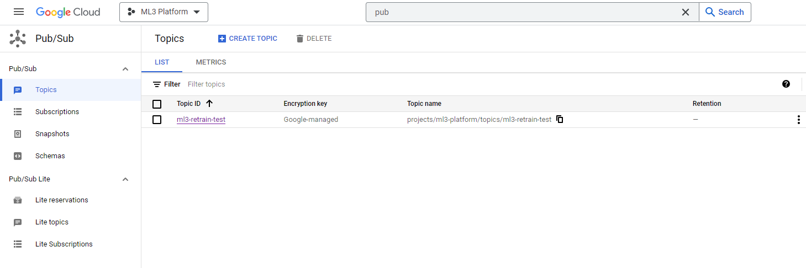{ width="800" }
        </figure>
    
    2. Click on the `Create topic` button. Then give it a unique id and create it.
        <figure markdown>
        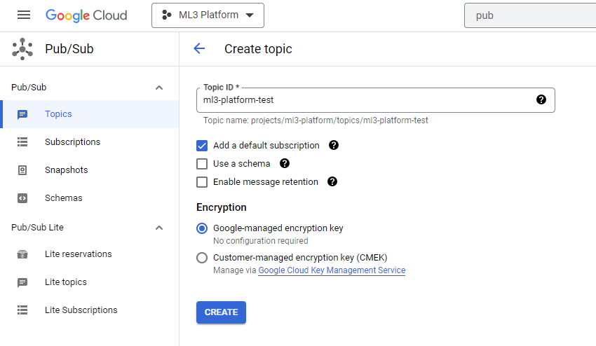{ width="800" }
        </figure>

    3. Configure your subscriptions as needed to configure the service that will handle the events.

    The ML cube platform will send events with this format:
    ```json
    {
        "project_id": "your gcp project id",
        "topic_name": "your unique topic id",
        "source": "ml3_platform",
        "event_type": "retrain_trigger",
        "payload": {
            "model_id": "id of the model on ml cube platform"
        }
    }
    ```

    **Retrain Trigger Setup**

    To integrate GCP Pub/Sub, you need to create a set of GCP credentials, and add a policy that allows to put events 
    in your Pub/Sub topic. Please refer to [this page](index.md) for more information.

    Once the credentials and the policy have been created, you can set up the retrain trigger for your model through the SDK or 
    the web application.

    ??? code-block "SDK Example"

        Here is an example of how to set up a GCP Pub/Sub Retrain Trigger using the SDK:

        ```py
        client.set_retrain_trigger(
            model_id='your_model_id',
            trigger=GCPPubSubRetrainTrigger(
                credentials_id='your_credentials_id',
                topic_name='your-topic'
            ),
        )
        ```

=== "Azure Event Grid"
    {: style="height:50px;width:50px"}

    If your MLOps pipelines are set up in the Microsoft Azure ecosystem, then you probably need the Azure Event Grid retrain trigger.

    The trigger, when activated, will create an event in an Event Grid topic of your Azure resource group with custom metadata.

    #### Topic Setup

    1. In the Azure console, open the Event Grid service and select the `Topics` option in the left-side menu
        <figure markdown>
        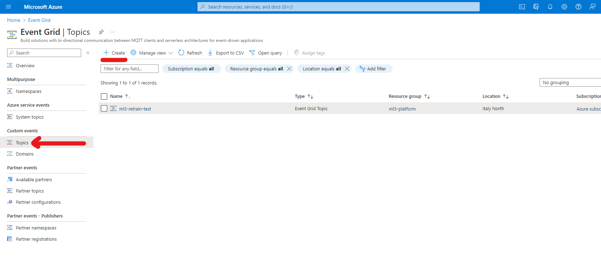{ width="800" }
        </figure>
    
    2. Click on the `Create` button. Select an active subscription and the resource group, then give the topic a unique name, select your preferred region and create it.
        <figure markdown>
        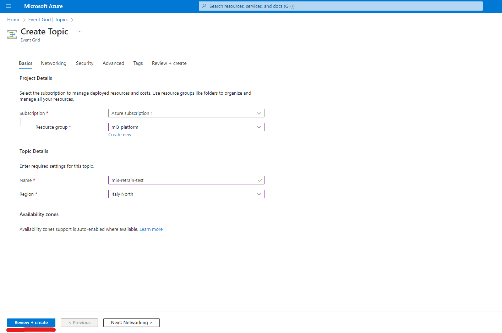{ width="800" }
        </figure>

    3. Configure your subscriptions as needed to configure the service that will handle the events.

    The ML cube platform will send events with this format:
    ```json
    {
        "subject": "ml3_platform",
        "event_type": "retrain_trigger",
        "data_version": "1.0",
        "data": {
            "model_id": "id of the model on ml cube platform"
        }
    }
    ```

    **Retrain Trigger Setup**

    To integrate Azure Event Grid, you need to create a set of Azure credentials, and add a role that allows to publish events in your Event Grid topic. 
    Please refer to [this page](index.md) for more information.

    Once the credentials and the policy have been created, you can set up the retrain trigger for your model through the SDK or the web application.

    ??? code-block "SDK Example"

        Here is an example of how to set up an Azure Event Grid Retrain Trigger using the SDK:

        ```py
        client.set_retrain_trigger(
            model_id='your_model_id',
            trigger=AzureEventGridRetrainTrigger(
                credentials_id='your_credentials_id',
                topic_endpoint='https://your-retrain-topic.italynorth-1.eventgrid.azure.net/api/events'
            ),
        )
        ```
