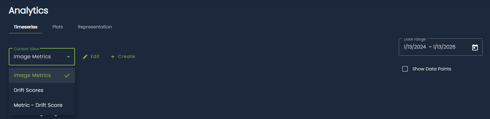
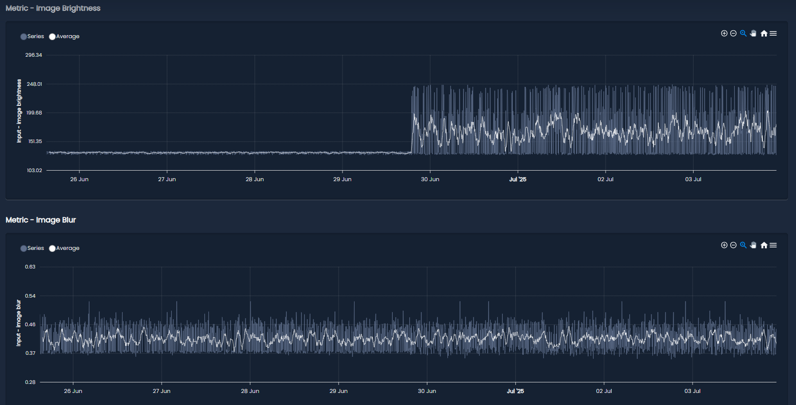
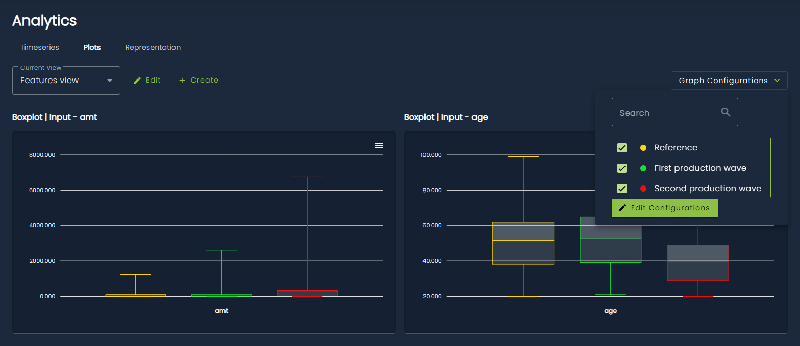
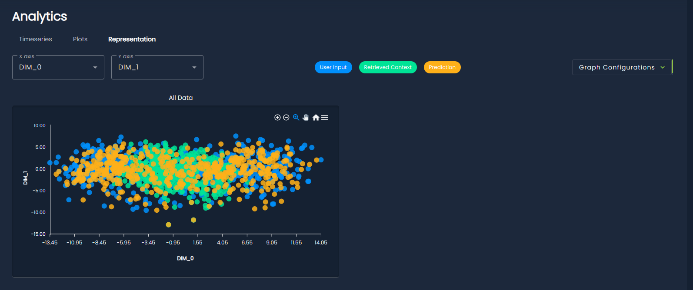
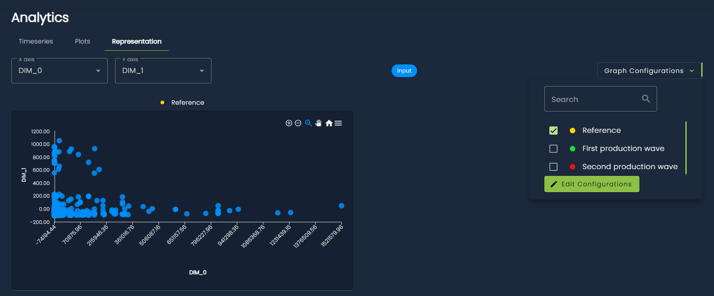

# Analytics

The Analytics section provides a set of tools and visualizations to help users explore data, visualize model performance and track drift scores over time. It is currently organized into three distinct sections, accessible through the tabs at the top of the page: *Timeseries*, *Plots* and *Representation*.

!!! note
    The Analytics section is a legacy module that is currently being redesigned with a new interface.

## Timeseries

The *Timeseries* section allows you to visualize how different quantities evolve over time. It is organized into *views*. A view is a collection of related timeseries charts grouped together for convenience. For example, you might have one view dedicated to image-related metrics and another view showing drift scores over time. 

You can select which view to display using the dropdown at the top left of the page. Existing views can be edited and new ones can be created, using the buttons next to the view selector.

<figure markdown>
  
  <figcaption>Views selection in Timeseries tab.</figcaption>
</figure>

Data are filtered over a configurable time range (by default, the last two years). You can change this range using the time range selector at the top right of the page. An additional option allows you to display a dot for each individual data point, making it easier to see the exact location of samples.

The main content of the page consists of the timeseries charts for the selected view. Each chart has its own title and typically displays both the raw data and a moving average to help highlight trends over time. You can zoom into a specific region of a chart by clicking and dragging, and you can download charts as SVG or PNG files using the menu in the top-right corner of each chart.

<figure markdown>
  
  <figcaption>Some examples of Timeseries charts.</figcaption>
</figure>

## Plots

The *Plots* section focuses on visualizing data distributions using both univariate plots (such as boxplots, density plots, and histograms) and bivariate plots (scatter plots).

As in the Timeseries section, plots are organized into views, which group together related visualizations. Views in the Plots section are independent from those in the Timeseries section, since they contain different visualization types.

In addition, this section introduces the concept of *graph configurations*. A configuration represents a specific time interval and is associated with a color. The plots in the selected view will display data only for the active configurations, which effectively act as a legend. This makes it easy to compare data distributions across different time periods. Configurations can be created, edited, and selected using the dropdown at the top right of the page.

<figure markdown>
  
  <figcaption>Plots section.</figcaption>
</figure>

Graph configurations can also be created automatically based on two types of events:

- when a model reference is set
- when a data partition is detected by an internal monitoring algorithm

These behaviors can be enabled by setting the appropriate task attributes, either when creating the task through the SDK or via the web interface (navigate to the Settings page, then the Analytics section).

## Representation

The *Representation* section provides a way to visualize high-dimensional data projected into a two-dimensional space. The projections are computed using a dimensionality reduction algorithm (currently [PCA](https://en.wikipedia.org/wiki/Principal_component_analysis)) and then displayed as scatter plots.

Unlike the previous sections, there is no concept of views here. Instead, this page reuses the graph configurations defined in the Plots section, with slightly different behavior. A separate scatter plot is displayed for each selected configuration, allowing for a visual comparison of data distributions across different time intervals. If no configuration is selected, all data are shown together in a single scatter plot.

For tasks with multiple entities (for example, RAG tasks with user input, retrieved context, and model output), each scatter plot displays all entities together using different colors. You can optionally filter by entity using the dropdown at the top left of the page.

<figure markdown>
  
  <figcaption>Representation tab in a RAG task. Since no configuration is selected, all data is displayed together.</figcaption>
</figure>

<figure markdown>
  
  <figcaption>Representation tab in a tabular task. Only a configuration is selected and shown.</figcaption>
</figure>

You can also choose which dimensions to display in the scatter plots. By default, the first two principal components are shown, but this can be changed using the dimension selectors at the top left of the page.