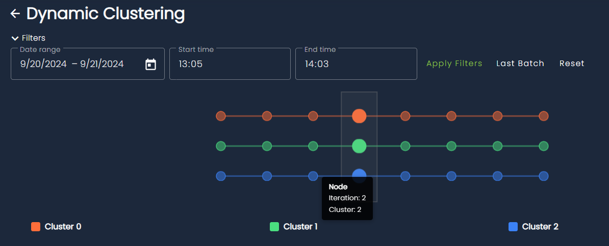
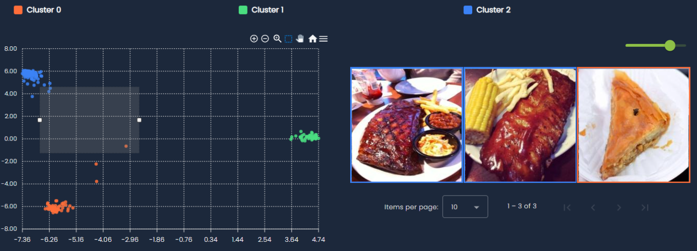
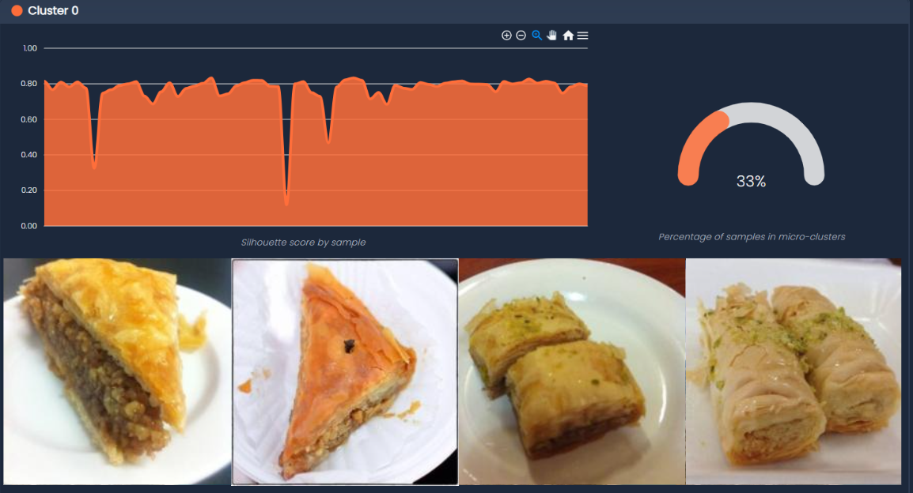
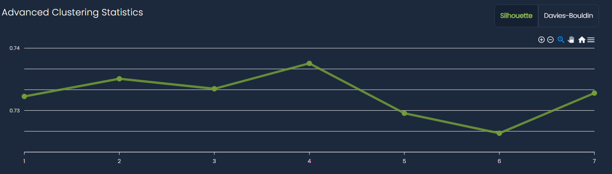
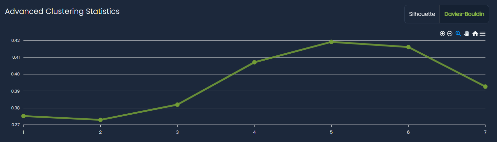

# Dynamic Clustering

## Overview

The Dynamic Clustering page provides an interactive exploration interface for analyzing clustered data through multiple coordinated views. This tool helps you understand patterns, relationships, and quality metrics across your clustered samples.

## Understand Cluster Evolution with the History Graph

The timeline visualization at the top shows how samples progress through different clusters over time or across dimensions:

- **Multiple cluster tracks**: Each row represents a different cluster (Cluster 0, Cluster 1, Cluster 2, etc.)
- **Connected nodes**: Circles connected by lines show the progression and relationships between samples

### Transition Types

Cluster evolution is characterized using explicit transition types that describe how clusters change between consecutive iterations:

- Survival: A cluster persists with largely the same members across iterations, indicating stability.
- Appearance: A new cluster emerges that did not exist in the previous iteration.
- Disappearance: A cluster ceases to exist because its samples are reassigned or absorbed elsewhere.
- Merge: Two or more clusters combine into a single cluster, suggesting increased similarity or reduced separation.
- Split: A single cluster divides into multiple distinct clusters, often revealing finer-grained structure.
- Merge–Split: Multiple clusters merge and then reorganize into multiple new clusters within the same transition, indicating significant structural reconfiguration.
- Reappearance: A previously disappeared cluster re-emerges after one or more iterations, potentially with similar composition.
- Remerge: Clusters that were previously separate and merged once again after intermediate changes.
- Resplit: A cluster that had previously split undergoes another splitting event, further refining its internal structure.

## Explore Clusters in Embedding Space

Explore your data in 2D embedding space:

- **Color-coded clusters**: Each cluster is represented by a distinct color for easy identification
- **Interactive selection**: Draw selections directly on the scatter plot to filter and examine specific groups of samples

## Interpret Clusters with Cluster Cards

In order to give an immediate inepretation on what the clusters represent, each cluster card contains the following information:

- **Silhouette scores**: A bar chart showing the cohesion quality for each sample within the cluster
    - Higher scores (closer to 1.0) indicate samples that are well-matched to their cluster
    - Lower scores suggest samples that might be borderline or belong to multiple clusters

- **Micro-cluster percentage**: A gauge visualization showing what portion of samples belong to micro-clusters
    - Shows how much of the data is captured by dominant clusters
    - Helps to determining the distribution of clusters at current iteration

- **Sample gallery**: Visual thumbnails of the most relevant samples in the cluster
    - Provides qualitative insight into cluster composition
    - Helps validate that similar items are grouped together

## Measure Clustering Quality with Advanced Statistics

Monitor clustering quality metrics:

- **Silhouette score tracking**: Line chart showing how the overall clustering quality changes
    - X-axis represents different clustering iterations
    - Y-axis shows the silhouette coefficient (higher is better)

- **Davies-Bouldin index**: Alternative clustering quality metric (available via tab)
    - Lower scores indicate better cluster separation
    - Useful for comparing different clustering approaches

