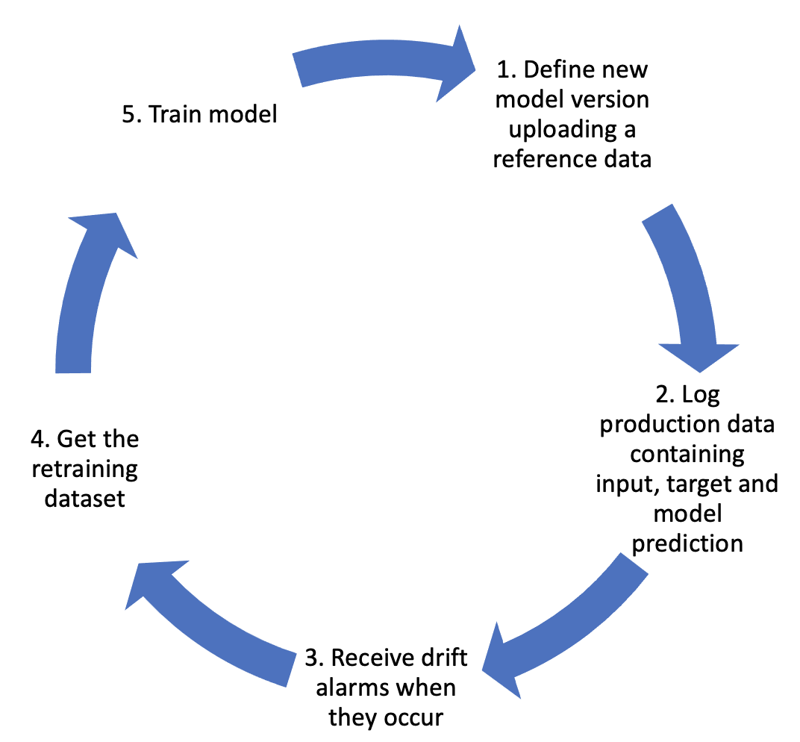

# Modules

ML cube Platform covers all the aspects of the *post-deployment life cycle* of your AI models:

<figure markdown>
  { width="500" }
  <figcaption>Post-deployment AI model life cycle.</figcaption>
</figure>

!!! note "Delta Energy inc"
    In Delta Energy data are collected every minute and are sent simultaneously to ML cube Platform.
    Ground truth data like the presence of a fault and the fault category are uploaded after they are available and therefore, they will sent with a delay compared the others.
    Drift alerting system is integrated with their Microsoft Teams and ML cube Platform sends alerts to the specified channels.
    After they receive an alerting message, they run a retraining pipeline that communicated with ML cube Platform to retrieve the retraining dataset to use.
    After that, they are ready to update the new version on ML cube Platform to start the monitoring.

-   :material-text-search-variant:{ .lg .middle } **Monitoring**

    ---

    Monitor data and model, detect drifts and receive alerts.

    [:octicons-arrow-right-24: More info](monitoring)

-   :fontawesome-solid-gears:{ .lg .middle } **Retraining**

    ---

    Adapt your models to the current concept with new retraining dataset.

    [:octicons-arrow-right-24: More info](retraining)

-   :material-label:{ .lg .middle } **Labeling**

    ---

    Find which data to label to improve the overall performance.

    [:octicons-arrow-right-24: More info](labeling)

-   :material-briefcase:{ .lg .middle } **Business**

    ---

    Monitor business KPI to validate the impact of your models.

    [:octicons-arrow-right-24: More info](business)

