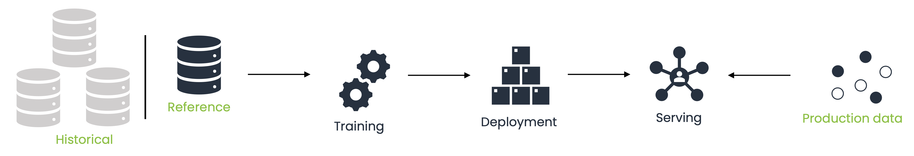

# Monitoring

Data and model monitoring is fundamental to guarantee performance of your ML models.
With ML cube Platform you can log and monitor different aspects of your ML Task by uploading data batches.
Before entering in details about what ML cube Platform monitors and analyses, it is worth to mention how data are represented.
Data are shared as _batches_

## Data Taxonomy

A Batch of data is composed of four types categories:

- **input:** set of input features the AI model uses to predict the output.
  ML cube Platform uses the input data that comes at the end of the processing data pipeline and not the raw data.
  This is due to the fact that ML cube Platform detects drifts in what the AI model uses and not in the general data the customer has.
- **target:** target quantity predicted by the AI models.
  It is present in the training data but can be not available for production data.
- **models' predictions:** predicted target for each AI model in the AI Task.
- **metadata:** additional information that AI models do not use as input but that is important to define the data or the samples.
  Mandatory for this category are the `sample-id`, a unique identifier for each sample used to avoid confusion and misinterpretation; and the
  `sample-timestamp`, a timestamp associated with each sample used for ordering.
  Moreover, the User can provide additional data used to segment the data space.
  For instance, sensitive information like zip code or country are not used by AI models to prevent bias, however, ML cube Platform can use them to
  check and prevent bias in the suggested retraining dataset or to perform segmented drift detection.

## Data Categories

ML cube Platform are present three categories of data:

- **Reference:** represents the dataset used to train the model.
  Each model version has a reference dataset.
  Detection algorithms use reference data during their initialization.
- **Production:** represents data that comes from the production environment in which the AI model is operating.
  Detection algorithms analyze production data to detect the presence of drifts.
- **Historical:** represents additional data that ML cube Platform can use to define the retraining dataset after a drift.

Each data category is uploaded to the application with its specific API call, however, they share the same structure.
When a data batch is uploaded the data source for each each data type (input, target, prediction) is specified.

The peculiarity of **Production** upload is that data types can be sent asynchronously with different API calls.
That's why during production data arrive at different times, usually input and prediction are available together and target after a while.

<figure markdown>
  { width="1000" }
  <figcaption>ML cube Platform data categories.</figcaption>
</figure>

!!! tip "Delta Energy inc"

    Delta Energy company trained its models using the data in the year 2022 and used the algorithms starting from the 2023. This means that the data in the 2022 are the reference data and every data from the january first 2023 are considered as production data. Data previous 2022 are historical data instead.

## Drift Detection

ML cube Platform provides a set of Detectors for each AI Task.
These detectors are used to monitor the task at different levels.
The choice over the types of detectors to be instantiated depends on the type of task (classification or regression) and on the type of data available for that task (input, output, model predictions).

There are mainly two classes of detectors:

- **Data Detectors:** they take into account data associated with the task. They may be _input only_
  data or _input and ground truth_ data. These detectors are independent from the models trained on the
  task as they do not either consider their predictions or performances. These detectors are responsible for the identification of
  input and concept drifts. According to the type of the used detector, changes in data are either monitored at feature
  level or using a multivariate monitoring strategy.
- **Model Detectors:** they monitor the performances associated with the models related to the task.
  In cases where the user has multiple models trained for a single task, a single detector is created for each model.

Each detector is initially created using **Reference data** provided by the user. Every time a new batch of data
is uploaded, the detectors observe the batch and update their statistics.  
Each detector updates its statistics independently from the others and each of them presents a double-level alarm scheme in
order to either signal a **Warning** or a **Drift** for the monitored task.

The detectors may be in three different states:

- **Regular:** the detector is monitoring data that are similar to the reference data,
- **Warning:** the detector has fired a Warning alarm since the data has started to change. From this zone, it is possible
  to either go into the Drift status or to go back to the Regular one, depending on the monitored data.
- **Drift:** the detector has fired a Drift alarm and a change has been established between the reference data and the last
  ones. After a drift, the detector is usually reset by defining a new set of reference data. The reset process is different
  according to what has been monitored by the detector.

All the alarms generated during this process are shown in the application like **Detection Events** available in the Task homepage or in the Detection page.
You can create automation rules based on those events to be notified on specific channels or start retraining, see [Detection automation rules](../detection_event_rules.md) for more details.
