# Multi-Turn Analysis

Conversational RAG systems do not answer a single isolated query. A user follows up, refers back to earlier answers, changes topic, or adds constraints on the structure of the response. Quality therefore depends on how well the model **tracks the session**, not only on how well a single turn matches its retrieved context.

Multi-Turn Analysis is the ML cube Platform module that evaluates those conversational sessions. It is available for [RAG Tasks](../task.md#retrieval-augmented-generation) created with the **Multi-turn** attribute enabled.

!!! info
    Single-turn [RAG Evaluation](rag_evaluation.md) scores the relationship between user input, retrieved context and response **inside one sample**. Multi-Turn Analysis groups samples into **sessions** and scores how each turn behaves in the conversation: core ideas, references to earlier turns, topic shifts, conciseness and positional bias.

## Required data

A multi-turn RAG Task needs the usual RAG columns plus two metadata columns that reconstruct the conversation:

| Column | Role | Subrole | Description |
| ------ | ---- | ------- | ----------- |
| User query | INPUT | RAG User Input | The user message for this turn. |
| Retrieved context | INPUT | RAG Retrieved Context | Context retrieved for this turn. |
| Model response | PREDICTION | — | The generated answer for this turn. |
| Session identifier | METADATA | RAG Session ID | Groups turns that belong to the same conversation. |
| Turn identifier | METADATA | RAG Turn ID | Order of the turn inside the session, starting at `0`. |

A [data schema template](https://github.com/ml-cube/ml3-platform-docs/blob/main/data-schema-templates/rag_multi_turn.json) is available for this layout.

!!! note
    `session_id` and `turn_id` are identifiers used to rebuild the conversation. They should not be used as [segment](../segment.md) dimensions.

??? code-block "SDK Example"

    Create a multi-turn RAG Task and attach the session / turn metadata columns.

    ```python
    task_id = client.create_task(
        project_id=project_id,
        name="Multi-turn RAG Assistant",
        tags=["rag", "multi-turn"],
        task_type=ml3_enums.TaskType.RAG,
        data_structure=ml3_enums.DataStructure.TEXT,
        optional_target=True,
        text_language=ml3_enums.TextLanguage.ENGLISH,
        llm_default_answer="I'm sorry",
        multi_turn=True,
    )

    data_schema = ml3_models.DataSchema(
        columns=[
            ml3_models.ColumnInfo(
                name="sample_id",
                role=ml3_enums.ColumnRole.ID,
                is_nullable=False,
                data_type=ml3_enums.DataType.STRING,
            ),
            ml3_models.ColumnInfo(
                name="timestamp",
                role=ml3_enums.ColumnRole.TIME_ID,
                is_nullable=False,
                data_type=ml3_enums.DataType.FLOAT,
            ),
            ml3_models.ColumnInfo(
                name="user_input",
                role=ml3_enums.ColumnRole.INPUT,
                is_nullable=False,
                data_type=ml3_enums.DataType.STRING,
                subrole=ml3_enums.ColumnSubRole.RAG_USER_INPUT,
            ),
            ml3_models.ColumnInfo(
                name="retrieved_context",
                role=ml3_enums.ColumnRole.INPUT,
                is_nullable=False,
                data_type=ml3_enums.DataType.STRING,
                subrole=ml3_enums.ColumnSubRole.RAG_RETRIEVED_CONTEXT,
            ),
            ml3_models.ColumnInfo(
                name="session_id",
                role=ml3_enums.ColumnRole.METADATA,
                is_nullable=False,
                data_type=ml3_enums.DataType.STRING,
                subrole=ml3_enums.ColumnSubRole.RAG_SESSION_ID,
            ),
            ml3_models.ColumnInfo(
                name="turn_id",
                role=ml3_enums.ColumnRole.METADATA,
                is_nullable=False,
                data_type=ml3_enums.DataType.INTEGER,
                subrole=ml3_enums.ColumnSubRole.RAG_TURN_ID,
            ),
        ]
    )
    client.add_data_schema(task_id=task_id, data_schema=data_schema)
    ```

Configure the multi-turn [monitoring metrics](../monitoring/index.md#monitoring-metrics) on the Task so that sessions are evaluated as data is uploaded. Each of those metrics uses an explicit threshold.

Open a multi-turn RAG Task and select **Multi-Turn Analysis**. The page has two tabs:

| Tab | Description |
| --- | ----------- |
| Explore Sessions | Browse evaluated sessions individually as cards and drill down into a single session. |
| Reports | Bundle a chosen set of sessions into a named report with an aggregated summary. |

An **All sessions** button, next to the tabs, opens a drawer listing every session of the Task, evaluated or not, with a search by session ID. Use it to look up the session IDs needed for a report.

## Explore Sessions

The **Explore Sessions** tab lists evaluated sessions as cards.

<figure markdown="span" style="display: inline-block; text-align: center; width: 100%;">
  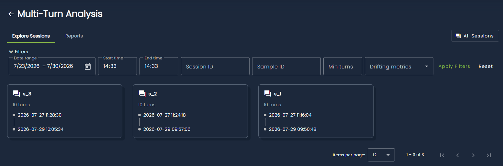
  <figcaption>Filters and session cards on the Multi-Turn Analysis page.</figcaption>
</figure>

Each card shows:

| Field | Description |
| ----- | ----------- |
| Session ID | Identifier sent in the `session_id` metadata column. |
| Number of turns | The number of turns evaluated within the session. |
| Timespan | Timestamps of the first and latest evaluated turns. |
| Drifting metrics | Multi-turn monitoring metrics that drifted on this session, when available. |

### Filters

Use the filter bar to narrow the list:

| Filter | Description |
| ------ | ----------- |
| Date range / start time / end time | Keep sessions whose **starting turn** falls in the interval. The default range is the last seven days up to the most recent data batch. |
| Session ID | Retrieves the session with the specified session ID. |
| Sample ID | Retrieves the session that contains the turn with this sample ID. |
| Min turns | Minimum conversation length. |
| Drifting metrics | Keep sessions that drifted on one or more multi-turn metrics. |

## Session analysis

Click a session card to open its analysis. Session-level scores are averages over the evaluated turns of that conversation.

<figure markdown="span" style="display: inline-block; text-align: center; width: 100%;">
  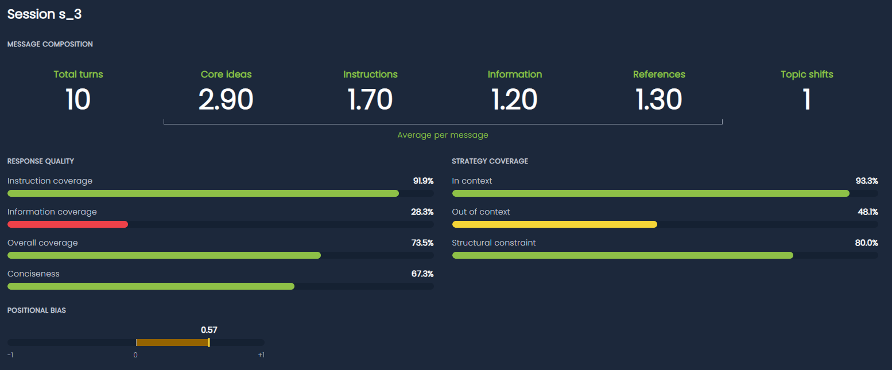
  <figcaption>Session-level composition, response quality, strategy coverage and positional bias.</figcaption>
</figure>

### Message composition

| Statistic | Description |
| --------- | ----------- |
| Total turns | Number of turns in the session. |
| Core ideas | Average number of core ideas extracted per user message. |
| Instructions | Average number of core ideas classified as **Instruction**. |
| Information | Average number of core ideas classified as **Information**. |
| References | Average number of references to earlier turns per message. |
| Topic shifts | Number of turns where the user topic changed relative to the previous turn. |

### Response quality

Quality bars are percentages from 0 to 100. Higher is better: green is high, yellow is medium, red is low.

| Metric | Description | Monitoring metric |
| ------ | ----------- | ----------------- |
| Instruction coverage | How well the response addresses instructional core ideas, weighted by importance. | `TEXT_MULTI_TURN_INSTRUCTION` |
| Information coverage | How well the response addresses informational core ideas, weighted by importance. | `TEXT_MULTI_TURN_INFORMATION` |
| Overall coverage | Importance-weighted coverage across all core ideas. | `TEXT_MULTI_TURN_OVERALL` |
| Conciseness | How close the response length is to a concise summary of itself. A long, redundant answer scores lower than a compact one. | `TEXT_MULTI_TURN_CONCISENESS` |

### Strategy coverage

Each core idea can be tagged with one or more response strategies. Session bars average those tag scores:

| Metric | Description | Monitoring metric |
| ------ | ----------- | ----------------- |
| In context | The core idea can be answered from the retrieved context. | `TEXT_MULTI_TURN_IN_CONTEXT` |
| Out of context | The core idea is not grounded in the retrieved context. | `TEXT_MULTI_TURN_OUT_OF_CONTEXT` |
| Structural constraint | The core idea imposes a format or structure (for example "reply with one capital word"). | `TEXT_MULTI_TURN_STRUCTURAL_CONSTRAINT` |

### Positional bias

The session **positional bias** gauge ranges from **-1** to **+1**. It is the mean correlation between core-idea **evaluation score** and **position** in the user message:

- Values near **0** mean the model treats early and late ideas similarly.
- **Positive** values mean later ideas in the message are answered better.
- **Negative** values mean earlier ideas are answered better.

This is the session view of the `TEXT_MULTI_TURN_POSITIONAL_BIAS` monitoring metric.

### Coverage across turns

The chart plots per-turn coverage over the conversation. Each series is a category, a strategy tag, or the overall score. Horizontal dashed lines mark the mean of each series. Gaps appear when a turn has no value for that series.

<figure markdown="span" style="display: inline-block; text-align: center; width: 100%;">
  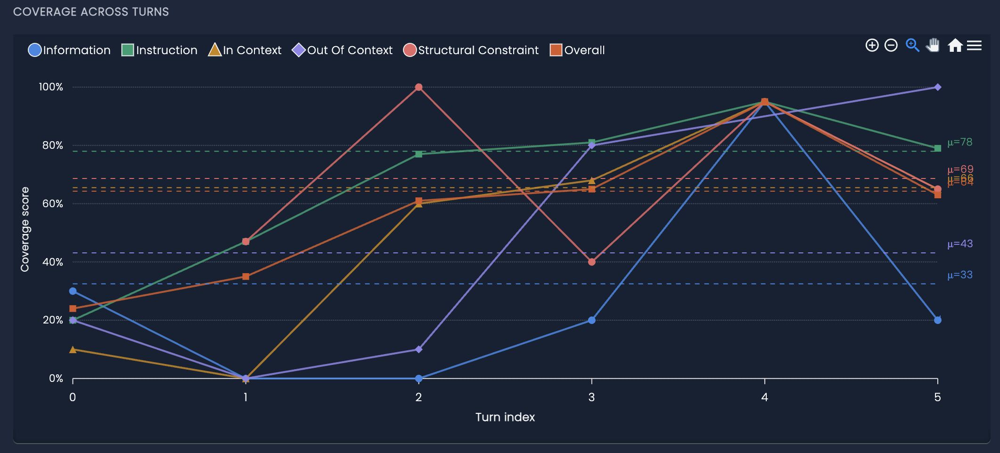
  <figcaption>Per-turn coverage scores along the session.</figcaption>
</figure>

Click a point in the chart legend to hide a series. Use the **turn slider** or the **Turn** field to inspect a specific turn.

<figure markdown="span" style="display: inline-block; text-align: center; width: 100%;">
  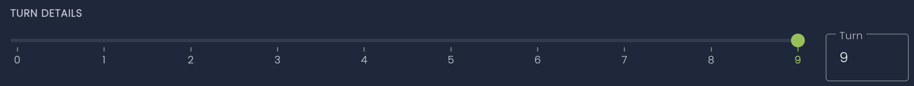
  <figcaption>Turn Sider</figcaption>
</figure>

## Turn details

The selected turn shows the reconstructed conversation and every evaluation artifact computed for that sample.

<figure markdown="span" style="display: inline-block; text-align: center; width: 100%;">
  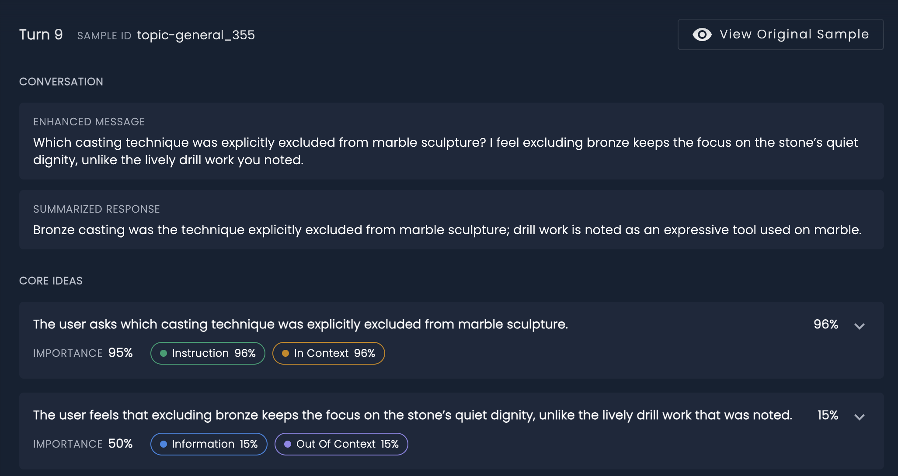
  <figcaption>Turn header, enhanced message, summarized response and core-idea cards.</figcaption>
</figure>

**View original sample** opens the Data Explorer sample viewer for the underlying `sample_id`.

### Conversation

Before scoring, the pipeline rewrites the user message using previous turns (**enhanced message**) and compresses the model output (**summarized response**). Follow-up questions such as "which of those should we prioritize?" become self-contained, so later steps can evaluate the turn without replaying the full chat.

### Core ideas

A **core idea** is an atomic request or statement extracted from the enhanced message. Each idea has:

| Field | Description |
| ----- | ----------- |
| Text | The idea in natural language. |
| Importance | 0–100, how central the idea is to the user message. |
| Evaluation score | 0–100, how well the response addresses that idea. |
| Category | **Instruction** (something to do) or **Information** (something stated or asked). |
| Tags | Strategy tags: In context, Out of context, Structural constraint. |
| Rationale | Short explanation of the score, category and tags. |

Expand a card to read the rationales for the idea, its category and each tag.

<figure markdown="span" style="display: inline-block; text-align: center; width: 100%;">
  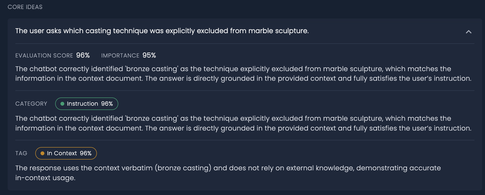
  <figcaption>Expanded core ideas with evaluation scores, importance, categories, tags and explanations.</figcaption>
</figure>

### References

References are phrases that point to earlier turns ("that quarry", "the drill work you noted"). The message is shown with those phrases underlined. Click an underlined span to open its resolution score and explanation.

The **overall score** is how well the response resolves the references in the current message (`TEXT_MULTI_TURN_REFERENCE_RESOLUTION`).

<figure markdown="span" style="display: inline-block; text-align: center; width: 100%;">
  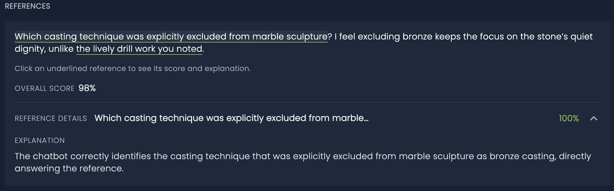
  <figcaption>Underlined references, overall resolution score, and the explanation of the selected reference.</figcaption>
</figure>

### Topic shift

When the user topic changes relative to the previous turn, a **Topic shifted** badge appears, with the previous topic, the current topic, a score and a rationale (`TEXT_MULTI_TURN_TOPIC_SHIFT`). The score measures whether the response followed the new topic.

<figure markdown="span" style="display: inline-block; text-align: center; width: 100%;">
  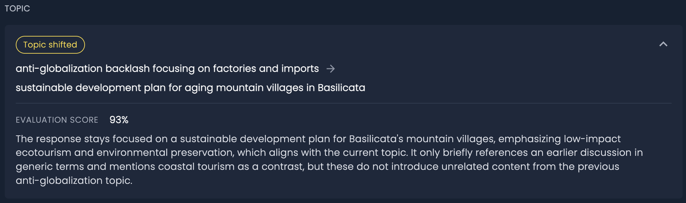
  <figcaption>A turn where the topic moved.</figcaption>
</figure>

### Conciseness, overall evaluation and correlations

The bottom of the turn panel summarises length, aggregate scores and correlations across the core ideas of that message.

<figure markdown="span" style="display: inline-block; text-align: center; width: 100%;">
  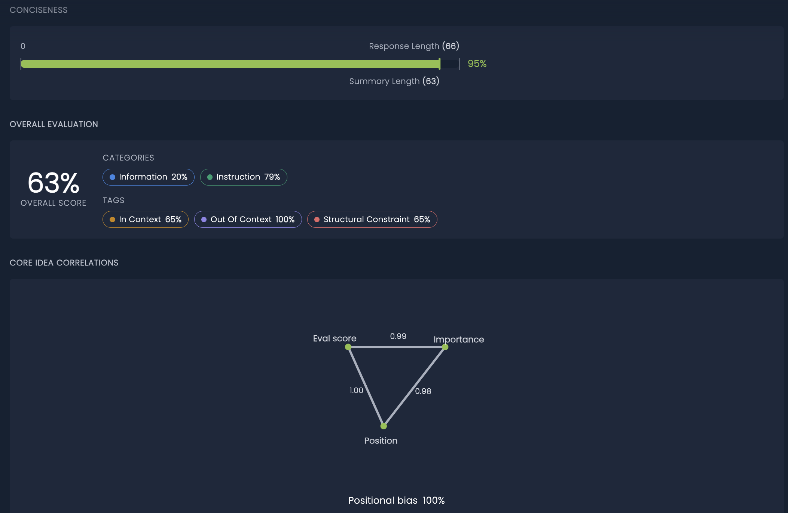
  <figcaption>Conciseness bar, overall category/tag scores, and core-idea correlations.</figcaption>
</figure>

**Conciseness** compares **response length** with **summary length**. The score is the summary-to-response length ratio, expressed as a percentage. A response that is already as short as its summary scores close to 100%. A verbose response whose summary is much shorter scores low.

**Overall evaluation** repeats the turn-level overall score together with the aggregated category and tag chips (the same series shown on the coverage chart).

**Core idea correlations** relate three quantities computed on the ideas of the turn:

| Correlation | Meaning |
| ----------- | ------- |
| Eval score vs importance | Whether important ideas are also the ones answered well. |
| Eval score vs position | Whether later (or earlier) ideas in the message are answered better. |
| Importance vs position | Whether important ideas appear later (or earlier) in the message. |
| Positional bias | Turn-level bias score from 0 to 100, derived from the partial correlation of score vs position given importance. |

When the three pairwise correlations form a valid triangle, they are drawn as a graph. Otherwise the values are shown as a table.

## Reports

The **Reports** tab bundles a chosen set of sessions into a named report with an aggregated summary. A report guarantees that every session included in it is evaluated for the Task's applicable multi-turn monitoring metrics.

### Generating a report

Click **New report**, give it a unique name, and add one or more session IDs (use the **All sessions** drawer to look them up). Creating the report starts a job that evaluates any session that is not yet evaluated.

<figure markdown="span" style="display: inline-block; text-align: center; width: 100%;">
  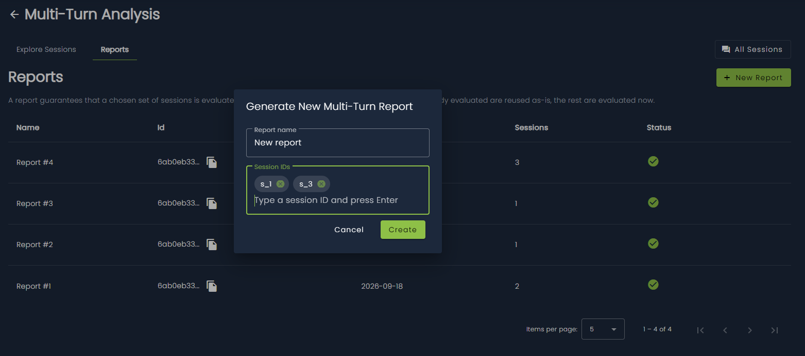
  <figcaption>Naming a report and selecting its sessions.</figcaption>
</figure>

The **Reports** tab lists every report created for the Task:

| Column | Description |
| ------ | ----------- |
| Name | The report name. |
| Id | Report identifier, with a copy-to-clipboard action. |
| Created | Creation date of the report. |
| Sessions | Number of sessions included in the report. |
| Status | Job status: pending, completed or error. Pending reports can be refreshed manually. |

??? code-block "SDK Example"

    Compute a multi-turn report for a set of sessions and wait for it to complete.

    ```python
    # Computing the multi-turn report
    multi_turn_report_job_id = client.compute_multi_turn_report(
        task_id=task_id,
        report_name="multi_turn_report_name",
        session_ids=["session_1", "session_2", "session_3"],
    )

    # Waiting for the job to complete
    client.wait_job_completion(job_id=multi_turn_report_job_id)

    # Getting the report
    reports = client.get_multi_turn_reports(task_id=task_id)
    report = reports[-1]
    ```

### Report summary

Click a completed report to open its summary.

A compact stats row averages, across the evaluated sessions of the report: total turns analyzed, core ideas, instructions, information and references per message, average topic shifts and positional bias. When any session in the report drifted on a monitoring metric, a **Drifting metrics** row counts how many sessions drifted per metric.

The **Rank sessions by** dropdown selects which metric drives the **Best session** and **Worst session** highlight cards. Click a card to open that session's [analysis](#session-analysis).

Two gauge groups show the report-wide average of the [response quality](#response-quality) and [strategy coverage](#strategy-coverage) metrics, one gauge per metric.

<figure markdown="span" style="display: inline-block; text-align: center; width: 100%;">
  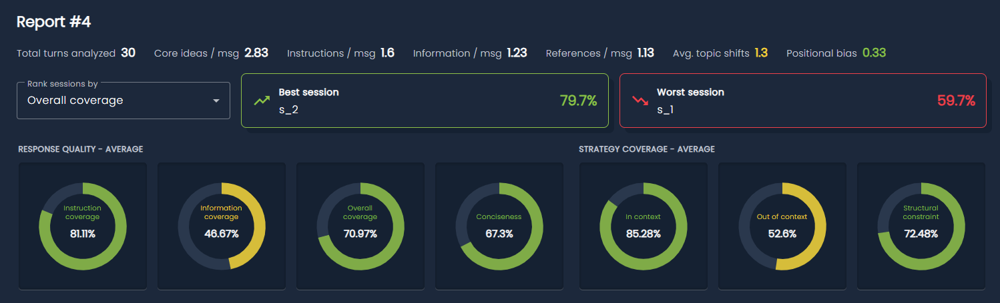
  <figcaption>Compact stats and session highlights; response quality and strategy coverage, averaged across the report's sessions.</figcaption>
</figure>

Below the gauges, a session selector chooses which sessions are plotted as radar charts, one polygon per session, on the same response quality and strategy coverage metrics. Click a session in the legend to show or hide its polygon.

<figure markdown="span" style="display: inline-block; text-align: center; width: 100%;">
  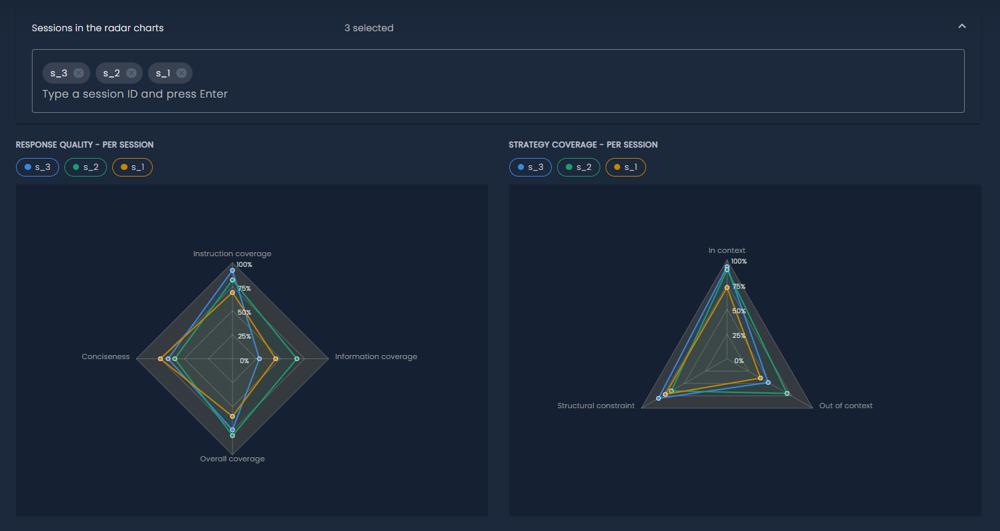
  <figcaption>Response quality and strategy coverage, per session, plotted as radar charts.</figcaption>
</figure>

### Sessions details

The bottom of the report page lists the report's sessions as cards, using the same layout as [Explore Sessions](#explore-sessions). Click a card to open its [session analysis](#session-analysis) and [turn details](#turn-details) inline.

## Monitoring metrics

The following [monitoring metrics](../monitoring/index.md#monitoring-metrics) are produced by Multi-Turn Analysis and can be used for drift detection on the **prediction** of a multi-turn RAG Task:

| Monitoring metric | Turn-level quantity |
| ----------------- | ------------------- |
| TEXT MULTI TURN INFORMATION | Information coverage |
| TEXT MULTI TURN INSTRUCTION | Instruction coverage |
| TEXT MULTI TURN OVERALL | Overall coverage |
| TEXT MULTI TURN IN CONTEXT | In-context strategy coverage |
| TEXT MULTI TURN OUT OF CONTEXT | Out-of-context strategy coverage |
| TEXT MULTI TURN STRUCTURAL CONSTRAINT | Structural-constraint coverage |
| TEXT MULTI TURN POSITIONAL BIAS | Positional bias |
| TEXT MULTI TURN CONCISENESS | Conciseness |
| TEXT MULTI TURN REFERENCE RESOLUTION | Reference-resolution score |
| TEXT MULTI TURN TOPIC SHIFT | Topic-shift score (on turns where the topic changed) |

[Task]: ../task.md
[Web App]: https://app.platform.mlcube.com/
[SDK]: ../../api/python/index.md
