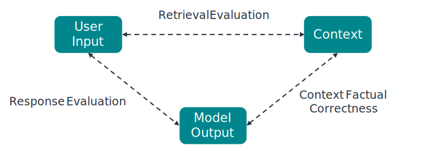

# Rag Evaluation

## Introduction

RAG (Retrieval-Augmented Generation) is a way of building AI models that enhances their ability to generate accurate and contextually relevant responses by combining two main steps: **retrieval** and **generation**.

1. **Retrieval**: The model first searches through a large set of documents or pieces of information to "retrieve" the most relevant ones based on the user query.
2. **Generation**: It then uses these retrieved documents as context to generate a response, which is typically more accurate and aligned with the question than if it had generated text from scratch without specific guidance.

Evaluating RAG involves assessing how well the model does in both retrieval and generation.

Our RAG evaluation module analyzes the three main components of a RAG framework:

| Component  | Description                                                                        |
| ---------- | ---------------------------------------------------------------------------------- |
| User Input | The query or question posed by the user.                                           |
| Context    | The retrieved documents or information that the model uses to generate a response. |
| Response   | The generated answer or output provided by the model.                              |

In particular, the analysis is performed on the relationships between these components:

- **User Input - Context**: Retrieval Evaluation
- **Context - Response**: Context Factual Correctness
- **User Input - Response**: Response Evaluation

<figure markdown>
  { width="600"}
  <figcaption>ML cube Platform RAG Evaluation</figcaption>
</figure>

The evaluation is performed through an LLM-as-a-Judge approach, where a Large Language Model (LLM) acts as a judge to evaluate the quality of a RAG model.

## Computed metrics

In this paragraph we describe the metrics computed by the RAG evaluation module, divided into the three relationships mentioned above. Every metrics computed is composed by a **score** and an **explanation** provided by the LLM, which explains the reasons behind the assigned score.

Below is a summary table of the metrics:

| Metric       | User Input       | Context          | Response         |
| ------------ | ---------------- | ---------------- | ---------------- |
| Relevance    | :material-check: | :material-check: |                  |
| Usefulness   | :material-check: | :material-check: |                  |
| Utilization  | :material-check: | :material-check: |                  |
| Attribution  | :material-check: | :material-check: |                  |
| Faithfulness |                  | :material-check: | :material-check: |
| Satisfaction | :material-check: |                  | :material-check: |

### User Input - Context

| Metric      | Description                                                                                                                                                                                                  | Score Range (Lowest-Highest)                                |
| ----------- | ------------------------------------------------------------------------------------------------------------------------------------------------------------------------------------------------------------ | ----------------------------------------------------------- |
| Relevance   | How much the retrieved context is relevant to the user input.                                                                                                                                                | 1-5                                                         |
| Usefulness  | Evaluates how useful the retrieved context is in generating the response, that is if it contains the information to answer the user query                                                                    | 1-5                                                         |
| Utilization | Measures the percentage of the retrieved context that contains information for the response. A higher utilization score indicates that more of the retrieved context is useful for  generating the response. | 0-100                                                       |
| Attribution | Indicates which of the chunks of the retrieved context can be used to generate the response.                                                                                                                 | List of indices of the used chunks, first chunk has index 1 |

!!! example
    The **combination** of the metrics provides a comprehensive evaluation of the quality of the retrieved context.
    For instance, a **high relevance** score but **low usefulness** score indicates a context that talks about the topic of the user query but does not contain the information needed to answer it.

### Context - Response

| Metric       | Description                                                                                                                                                 | Score Range (Lowest-Highest) |
| ------------ | ----------------------------------------------------------------------------------------------------------------------------------------------------------- | ---------------------------- |
| Faithfulness | Measures how much the response contradicts the retrieved context. A higher faithfulness score indicates that the response is more aligned with the context. | 1-5                          |

### User Input - Response

| Metric       | Description                                                                                                                                                                                                                     | Score Range (Lowest-Highest) |
| ------------ | ------------------------------------------------------------------------------------------------------------------------------------------------------------------------------------------------------------------------------- | ---------------------------- |
| Satisfaction | Evaluates how satisfied the user would be with the generated response. A low score indicates a response that does not address the user quey, a high score indicates a response that fully addresses and answers the user query. | 1-5                          |

## Required data

The RAG evaluation module computes the metrics based on the data availability for each sample. 
If a sample lacks one of the three components (User Input, Context or Response), only the applicable metrics are computed. 
For instance, if in a sample the **response is missing**, only the **User Input - Context** metrics are computed for that sample.

Regarding the metrics that cannot be computed for a specific sample, the lowest score is assigned, with the explanation mentioning the component that is missing.

If data added to a [Task] contains contexts with multiple chunks of text, a [context separator](../task.md#retrieval-augmented-generation) must be provided.

When requesting the evaluation, a **timestamp interval** must be provided to specify the time range of the data to be evaluated.

[Task]: ../task.md