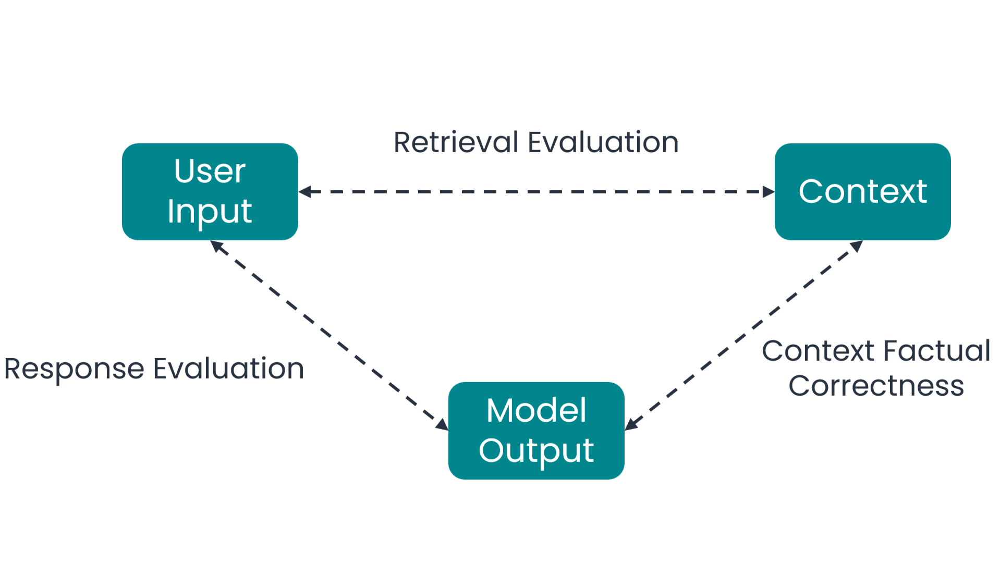

# RAG Evaluation

RAG (Retrieval-Augmented Generation) is a way of building AI models that enhances their ability to generate accurate and contextually relevant responses by combining two main steps: **retrieval** and **generation**.

1. **Retrieval**: The model first searches through a large set of documents or pieces of information from a specific knowledge base defined by the system designer to "retrieve" the most relevant ones based on the user query.
2. **Generation**: It then uses these retrieved documents as context to generate a response, which is typically more accurate and aligned with the question than if it had generated text from scratch without specific guidance.

Evaluating RAG involves assessing how well the model performs in both retrieval and generation. This evaluation is crucial to ensure that the model provides accurate and relevant responses to user queries.

The three main components of a RAG framework are:

| Component  | Description                                                                        |
| ---------- | ---------------------------------------------------------------------------------- |
| User Input | The query or question posed by the user.                                           |
| Context    | The retrieved documents or information that the model uses to generate a response. |
| Response   | The generated answer or output provided by the model.                              |

!!! example
    This is an example of the three components of a RAG:

    - **User Input**: "What is the capital of France?"
    - **Context**: "Paris, the capital of France, ..."
    - **Response**: "The capital of France is Paris."

## RAG Evaluation Module
The ML cube Platform RAG evaluation module is available for [RAG Tasks](../task.md#retrieval-augmented-generation) and generates an evaluation report for a given set of samples.

!!! info
    It is possible to compute a RAG evaluation report both from [Web App] and [SDK]. The computed report can be viewed in the Web App and exported as an Excel file from the SDK.

The report is computed by analyzing the relationships between the three RAG components:

<figure markdown>
  { width="600"}
  <figcaption>The three evaluations performed by the RAG Evaluation Module</figcaption>
</figure>


### Computed metrics

This paragraph describes the metrics computed by the RAG evaluation module, divided into the three relationships shown above. Every metrics computed is composed by a **value** and an **explanation** of the reasons behind the assigned value.

#### Retrieval Evaluation (User Input - Context)

| Metric      | Description                                                                                                                                                                                         | Returned Value                                              |
| ----------- | --------------------------------------------------------------------------------------------------------------------------------------------------------------------------------------------------- | ----------------------------------------------------------- |
| Relevance   | How much the retrieved context is relevant to the user input.                                                                                                                                       | 1-5 (lowest-highest)                                        |
| Usefulness  | How useful the retrieved context is in generating the response, that is if it contains the information to answer the user query.                                                                    | 1-5 (lowest-highest)                                        |
| Utilization | The percentage of the retrieved context that contains information for the response. A higher utilization score indicates that more of the retrieved context is useful for  generating the response. | 0-100 (lowest-highest)                                      |
| Attribution | Which of the chunks of the retrieved context can be used to generate the response.                                                                                                                  | List of indices of the used chunks, first chunk has index 1 |

!!! note
    The **combination** of the metrics provides a comprehensive evaluation of the quality of the retrieved context.

    For instance, a **high relevance** score but **low usefulness** score indicates a context that talks about the topic of the user query but does not contain the information needed to answer it:
    
    - **User Input**: "How many ECTS does a Computer Science bachelor's degree have?"
    - **Context**: "The main exams in a Bachelor's Degree in Computer Science typically cover programming, data structures, algorithms, computer architecture, operating systems, databases, and software engineering."

    This example has a high relevance score because the context talks about a Computer Science bachelor's degree, but a low usefulness score because it does not contain the specific information about the number of ECTS.

#### Context Factual Correctness (Context - Response)

| Metric       | Description                                                                                                                                        | Returned Value       |
| ------------ | -------------------------------------------------------------------------------------------------------------------------------------------------- | -------------------- |
| Faithfulness | How much the response contradicts the retrieved context. A higher faithfulness score indicates that the response is more aligned with the context. | 1-5 (lowest-highest) |

#### Response Evaluation (User Input - Response)

| Metric       | Description                                                                                                                                                                                                            | Returned Value       |
| ------------ | ---------------------------------------------------------------------------------------------------------------------------------------------------------------------------------------------------------------------- | -------------------- |
| Satisfaction | How satisfied the user would be with the generated response. A low score indicates a response that does not address the user query, a high score indicates a response that fully addresses and answers the user query. | 1-5 (lowest-highest) |

!!! example
    This is an example of the three evaluations performed by the RAG Evaluation Module:

    - **User Input**: "How many ECTS does a Computer Science bachelor's degree have?"
    - **Context**: "The main exams in a Bachelor's Degree in Computer Science typically cover programming, data structures, algorithms, computer architecture, operating systems, databases, and software engineering."
    - **Response**: "A Bachelor's Degree in Computer Science typically has 180 ECTS."

    | Metric       | Value | Explanation                                                                                            |
    | ------------ | ----- | ------------------------------------------------------------------------------------------------------ |
    | Relevance    | 5     | High relevance becayse the context talks about a Computer Science bachelor's degree.                   |
    | Usefulness   | 1     | Low usefulness because the context does not contain the specific information about the number of ECTS. |
    | Utilization  | 0     | No information in the context to generate the response.                                                |
    | Attribution  | []    | No chunk of the context can be used to generate the response.                                          |
    | Faithfulness | 5     | High faithfulness because the response does not contradict the context.                                |
    | Satisfaction | 5     | High satisfaciton because the response fully addresses the user query.                                 |

### Required data

Below is a summary table of the input data needed for each metric:

| Metric       | User Input       | Context          | Response         |
| ------------ | ---------------- | ---------------- | ---------------- |
| Relevance    | :material-check: | :material-check: |                  |
| Usefulness   | :material-check: | :material-check: |                  |
| Utilization  | :material-check: | :material-check: |                  |
| Attribution  | :material-check: | :material-check: |                  |
| Faithfulness |                  | :material-check: | :material-check: |
| Satisfaction | :material-check: |                  | :material-check: |

The RAG evaluation module computes the metrics for each sample based on the data availability. 
If a sample lacks one of the three components (User Input, Context or Response), only the applicable metrics are computed for that sample. 
For instance, if in a sample the **response is missing**, only the **User Input - Context** metrics are computed for that sample.

Regarding the metrics that cannot be computed for a specific sample, the lowest score is assigned, with the explanation mentioning the component that is missing.

If data added to a [Task] contains contexts with multiple chunks of text, a [context separator](../task.md#retrieval-augmented-generation) must be provided.

When requesting the evaluation, a **timestamp interval** must be provided to specify the time range of the data to be evaluated.

??? code-block "SDK Example"

    The following code demonstrates how to compute a rag evaluation report for a given timestamp interval.

    ```python
    # Computing the RAG evaluation report
    rag_evaluation_job_id = client.compute_rag_evaluation_report(
        task_id=task_id,
        report_name="rag_evaluation_report_name",
        from_timestamp=from_timestamp,
        to_timestamp=to_timestamp,
    )

    # Waiting for the job to complete
    client.wait_job_completion(job_id=rag_evaluation_job_id)

    # Getting the evaluation report id
    reports = client.get_rag_evaluation_reports(task_id=task_id)
    report_id = reports[-1].id

    # Exporting the evaluation report
    folder_path = 'path/to/folder/where/to/save/report/'
    client.export_rag_evaluation_report(
        report_id=report_id,
        folder=folder_path,
        file_name='rag_evaluation_report'
    )
    ```

[Task]: ../task.md
[Web App]: https://app.platform.mlcube.com/
[SDK]: ../../api/python/index.md