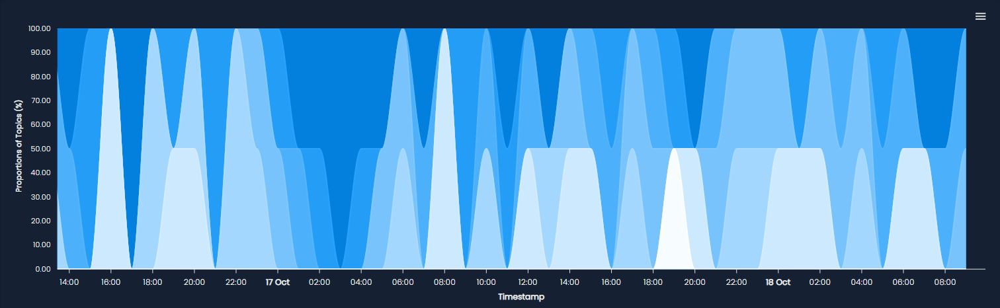

# Topic Modeling

The Topic Modeling module allow you to categorize documents based on their content. The goal is to represent each document as a set of topics, where a topic is composed by a list of words that commonly appear together. The percentage of topics in a document varies, suggesting the themes it covers and in what proportion.

!!! example
    Consider the case of a sport magazine. Words like "team," "game," and "score" would come up a lot, while words like "market" or "technology" would show up less frequently. This would suggest that the magazine's topics are centered around sports.

## Key Concepts

| Term                    | Description                                                                                         |
|-------------------------|-----------------------------------------------------------------------------------------------------|
| Topic               | A theme represented by a set of words that commonly appear together.                                 |
| Document Distribution | Each document shows a spread of topics, indicating the themes it covers and in what proportion.  |

## Supported Tasks and Data Structures
ML cube Platform supports the following tasks and data structures for Topic Modeling:

|Task Type| Tabular | Image | Text | Embedding|
| -- | -- | -- | -- | -- |
| Regression |  |  | :material-check: |  |
| Classification |  |  | :material-check: |  |
| RAG |  |  | :material-check: :material-information-outline:{title="Only for User Input"} |  |

<figure markdown="span" style="display: inline-block; text-align: center; width: 100%;">
  
  <figcaption style="white-space: nowrap;">Topic Modeling Timeseries: visualization of topic distribution over time.</figcaption>
</figure>
