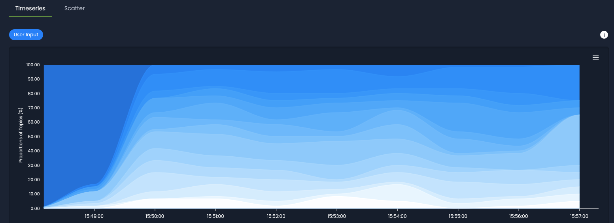

# Topic Modeling

The **Topic Modeling** module enables categorization of documents based on their content. It identifies groups of words that frequently appear together, referred to as **topics**, and associates them with documents. The ML Cube Platform supports Topic Modeling for text data structures. However, for [RAG] tasks, this feature is available only under the [Subrole]: `RAG User Input`.

!!! example
    Imagine an e-commerce company. The Topic Modeling module could identify commonly co-occurring words, such as `affordable price`, `product quality`, `delivery experience`, and `customer service support`. By examining these topics, the company can gain insights into areas where customers are satisfied or dissatisfied and perform targeted improvements.

??? code-block "SDK Example"
    The following code shows how to start a Topic Modeling job and retrieve its results.

    ```python
    # Start the topic modeling asynchronous job
    topic_modeling_job_id = client.compute_topic_modeling_report(
        task_id=task_id,
        report_name="topic_modeling_report_name",
        from_timestamp=initial_timestamp,
        to_timestamp=final_timestamp,
    )

    # Wait for the job to complete
    client.wait_job_completion(job_id=topic_modeling_job_id)

    # Retrieve all topic modeling reports
    topic_modeling_reports = client.get_topic_modeling_reports(task_id=task_id)

    # Access details of a specific report
    topic_report = client.get_topic_modeling_report(
        report_id=topic_modeling_reports[0].id
    )
    ```

## Topic Modeling Report
The Topic Modeling Report provides a comprehensive analysis of identified topics and associated documents. After providing a general overview, the report includes two sections: Visualization and Sample Viewer.

### Visualization
The ML Cube Platform supports two visualization options.

#### Timeseries
The Timeseries shows how topics evolve over time, revealing temporal trends. Documents are grouped into time intervals, the `x-axis` displays timestamps, while the `y-axis` shows the topic proportions as percentages, thus the height indicates the percentage of samples associated with that topic at a given time. From the figure below, it is possible to see how the prevalence of topics changes over time.

<figure markdown="span" style="display: inline-block; text-align: center; width: 100%;">
  
  <figcaption style="white-space: nowrap;">Topic Modeling Timeseries: visualization of topic distribution over time. </figcaption>
</figure>

#### Scatter Plot
The Scatter Plot helps identify topic clusters and their distribution in the reduced space, revealing patterns and relationships among the samples. Text data is high-dimensional, making it difficult to visualize. The ML Cube Platform uses dimensionality reduction techniques to visualize the embeddings. The `axes` show the selected dimensions, which you can adjust using the dropdown menu. Each point represents a document, and its color indicates the topic it belongs to.

<figure markdown="span" style="display: inline-block; text-align: center; width: 100%;">
  
  <figcaption style="white-space: nowrap;">Topic Modeling Scatter: dimensionality reduction of the embeddings.</figcaption>
</figure>

### Sample Viewer
This section provides detailed information about each document, represented by rows. The Sample Viewer includes the following fields:

| Field             | Description                                                                        |
|-------------------|------------------------------------------------------------------------------------|
| Sample Id         | Unique identifier of the sample, in this case represented by the document.         | 
| Timestamp         | Timestamp of the document expressed in seconds.                                    | 
| Topic             | Set of related co-occurring words, extracted from the document.                    | 
| User Input        | The user query submitted to the system.                                            | 
| Retrieved Context | The context that the retrieval system has selected to answer the query.            | 
| Prediction        | The final response of the system to the query.                                     | 

[RAG]: ../task/#retrieval-augmented-generation  
[Subrole]: ../data_schema.md/#subrole
