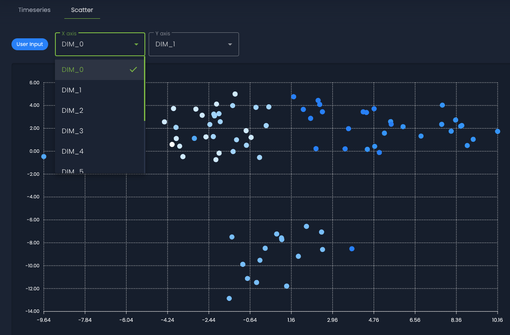

# Topic Modeling

The Topic Modeling module allows you to categorize documents based on their content. The goal is to represent each document as a set of topics, where a topic is made up of a list of words that commonly appear together. The percentage of topics in a document varies, suggesting the concepts it covers and in what proportion.

!!! example
    A company could use Topic Modeling to analyze customer reviews and identify areas for improvement. Imagine that an e-commerce company uses Topic Modeling to analyze customer reviews of its products. The Topic Modeling module could identify topics such as “price,” “quality,” “shipping,” and “customer service.” The company could then use this information to improve its products and services in areas where customers have expressed concerns or dissatisfaction.

ML cube Platform supports Topic Modeling in for text data structures because it is based on the analysis of words in documents. Moreover, for RAG tasks, Topic Modeling is available only for the user input.

??? code-block "SDK Example"
    The following code shows how to start a Topic Modeling job and then retrieve the results.

    ```py
    # In the following example, it is used
    # a Polars DataFrame for production data,
    # but you can use any other data structure.

    prod_data_df = pl.read_csv("production_data.csv")
    
    # Start the topic modeling asyncrhonous job
    topic_modeling_job_id = client.compute_topic_modeling_report(
        task_id=task_id,
        report_name="topic_modeling_report_name",
        from_timestamp=prod_data_df["timestamp"].min(), # The initial timestamp from which to start the analysis
        to_timestamp=prod_data_df["timestamp"].max(), # The final timestamp to end the analysis
    )

    # Wait for the job to complete
    client.wait_job_completion(job_id=job_ctmr_id)

    # Retrieve all the topic modeling reports.
    # This list provides metadata about all the topic modeling reports.
    topic_modeling_reports = client.get_topic_modeling_reports(
        task_id=task_id)

    # To retrieve specific details about a topic modeling report,
    # you can rely on the following method.
    topic_report = client.get_topic_modeling_report(
        report_id=topic_modeling_reports[0].id
    )
    ```

## Topic Modeling Report
The Topic Modeling includes the following sections:

* **Report Details:** gives a general overview on the total number of topics identified and the number of documents analyzed.
* **Visualization:** to help understand the topics identified and their distribution, the ML cube:
    * **Timeseries:** shows the distribution of topics in the corpus of documents, grouping samples over temporal batches.
      <figure markdown="span" style="display: inline-block; text-align: center; width: 100%;">
        
        <figcaption style="white-space: nowrap;">Topic Modeling Timeseries: visualization of topic distribution over time.</figcaption>
      </figure>
    * **Scatter Plot:** displays the dimensionality reduction of the embeddings. This visualization helps identify topic clusters and their distribution in the reduced space, revealing patterns and relationships among the samples.
      <figure markdown="span" style="display: inline-block; text-align: center; width: 100%;">
        
        <figcaption style="white-space: nowrap;">Topic Modeling Scatter: dimensionality reduction of the embeddings.</figcaption>
      </figure>
