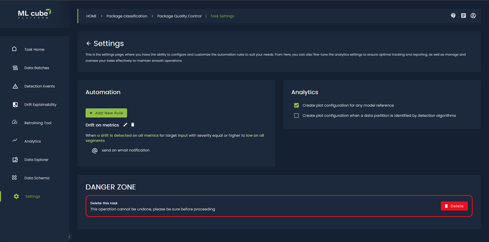
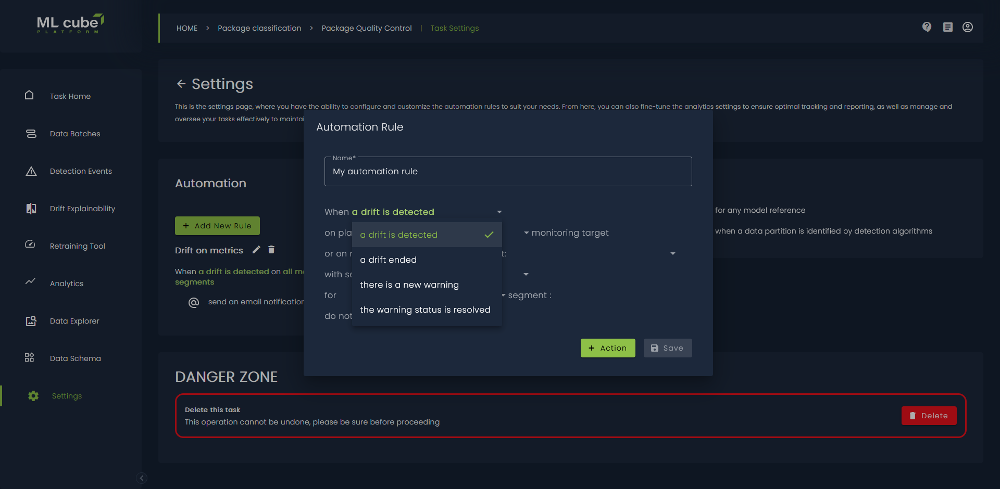
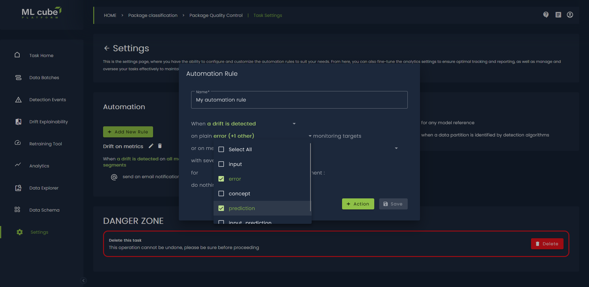
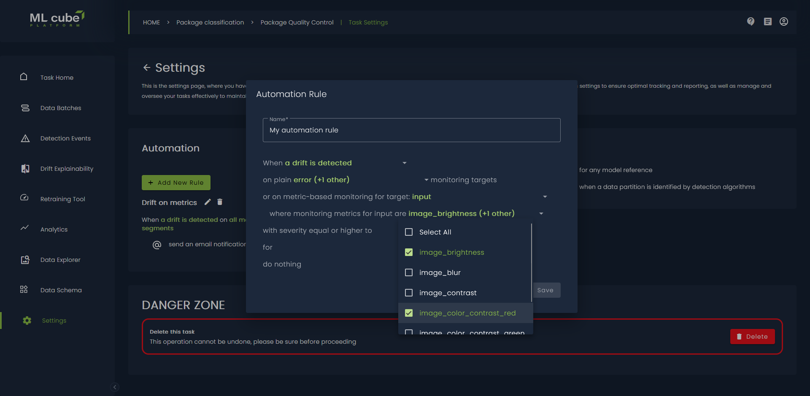
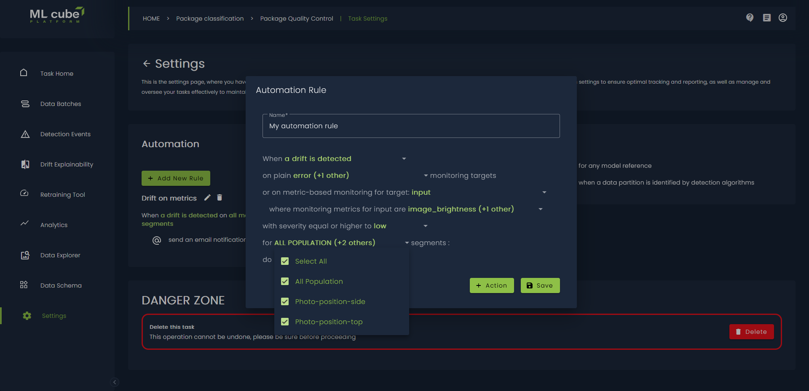
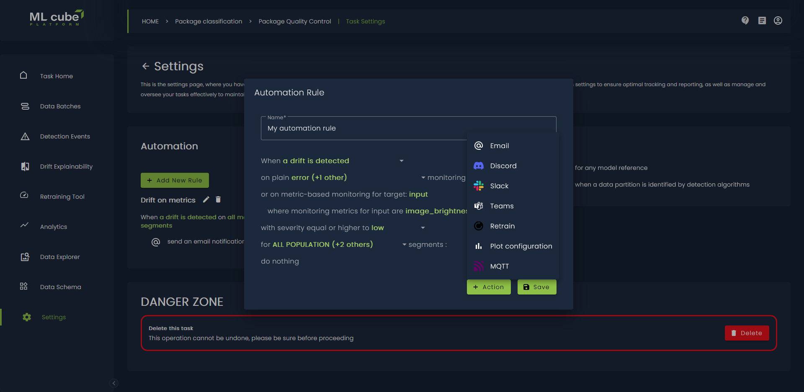

# Detection Event Rules

This section outlines how to configure automation to receive notifications or start retraining after a [Detection Event] occurs.
When a Detection Event is generated from the analysis of a production data batch, the ML cube Platform reviews all the Notification Rules you have set and triggers those matching the event.

The rules can be created on the Web App or using the Python SDK.


??? code-block "SDK Example"
    The following code demonstrates how to create a rule that matches high severity drift events on the error of a model. 
    When triggered, it first sends a notification to the `ml3-platform-notifications` channel on your Slack workspace, using the 
    provided webhook URL, and then starts the retraining of the model.

    Note that when a parameter is None it means that the rule is for _any_ value.

    ```py
    rule_id = client.create_detection_event_rule(
        name='Retrain model with notification',
        task_id='my-task-id',
        model_name='my-model',
        severity=DetectionEventSeverity.HIGH,
        detection_event_type=DetectionEventType.DRIFT_ON,
        monitoring_targets=[MonitoringTarget.ERROR, MonitoringTarget.INPUT],
        actions=[
            SlackNotificationAction(
                webhook='https://hooks.slack.com/services/...',
                channel='ml3-platform-notifications'
            ),
            RetrainAction()
        ],
    )
    ```

On the Web App you need to go on the Task Settings page and press the _Add new rule_ button:
<figure markdown style="width:70%">
  
  <figcaption>Task settings.</figcaption>
</figure>

After that you can need to define the detection event which is mandatory:

<figure markdown style="width:70%">
  
  <figcaption>Select detection event type.</figcaption>
</figure>

You need to specify what are the monitored entities, you need to specify at least one of Plain Monitoring Target or Monitoring Metrics for Monitoring Targets.
ML cube Platform monitors both the direct data like the input and extracted metrics like brightness of the image.
We refer as _plain monitoring target_ the monitoring of the input.

<figure markdown style="width:70%">
  
  <figcaption>Plain monitoring targets.</figcaption>
</figure>

For each Monitoring Target that has Monitoring Metrics you can select the metrics:

<figure markdown style="width:70%">
  
  <figcaption>Monitoring metrics for targets.</figcaption>
</figure>

If your task has data segments, you can add in the rule a condition about the monitored segment:

<figure markdown style="width:70%">
  
  <figcaption>Monitored segments.</figcaption>
</figure>

Finally, you can choose which actions to take when all the conditions are met:

<figure markdown style="width:70%">
  
  <figcaption>Rule actions.</figcaption>
</figure>

Rules are specific to a task and are characterized by the following attributes:

| Attribute                 | Description                                                                                                                                                            | 
|---------------------------|------------------------------------------------------------------------------------------------------------------------------------------------------------------------|
| Name                      | A descriptive label of the rule.                                                                                                                                       |
| Detection Event Type      | The type of event that triggers the rule.                                                                                                                              |
| Severity                  | The severity of the event that triggers the rule. It is only applicable to drift events. If not specified, the rule will be triggered by drift events of any severity. |
| Monitoring Target         | The [Monitoring Target](index.md#monitoring-targets) whose event should trigger the rule.                                                                              |
| Monitoring Metric         | The [Monitoring Metric](index.md#monitoring-metrics) whose event should trigger the rule.                                                                              |
| Specification             | The specification of the Monitoring Metric being monitored, if existing.                                                                                              |
| Monitoring Evaluation Metric | The [Evaluation Metric](index.md#monitoring-evaluation-metrics) whose event should trigger the rule.                                                         |
| Model name                | The name of the model to which the rule applies. This is only required when the monitoring target is related to a model (such as `ERROR` or `PREDICTION`).             |
| Actions                   | A list of actions to be executed sequentially when the rule is triggered.                                                                                              |
| Segment ID                | It refers to the ID of the Segment where the rule is set.                                                                                                              |

## Detection Event Actions
Three types of actions are currently supported: notification, plot configuration and retrain.

### Notifications

These actions send notifications to external services when a detection event is triggered. The following notification options are available:

| Channel              | Description                                            |
|----------------------|--------------------------------------------------------|
| Slack Notification   | Sends a notification to a Slack channel via webhook.   |
| Discord Notification | Sends a notification to a Discord channel via webhook. |
| Email Notification   | Sends an email to the provided email address.          |
| Teams Notification   | Sends a notification to Microsoft Teams via webhook.   |
| Mqtt Notification    | Sends a notification to an MQTT broker.                |

### Plot Configuration

This action consists in creating two plot configurations when a Detection Event is triggered: the first one includes
data preceding the event, while the second one includes data following the event.

### Retrain

Retrain Action enables the automatic retraining of your model. Therefore, it is only available when the target of the rule is related to a model.
The retrain action does not need any parameter because it is automatically inferred from the `model name` attribute of the rule.
Of course, the model must already have a [Retrain Trigger](../integrations/retrain_trigger.md) associated before setting up this action.

[Detection Event]: detection_event.md