# Drift Explainability

[Monitoring]  is a crucial aspect of the machine learning lifecycle, as it enables tracking the model's performance and its data over time,
ensuring the model continues to function as expected. However, monitoring only is not enough when it comes to the adaptation phase.

In order to make the right decisions, you need to understand what were the main factors that led to the drift in the first place, so that
the correct actions can be taken to mitigate it.
s
The ML cube Platform supports this process by providing what we refer to as **Drift Explainability Report**, 
automatically generated upon the detection of a drift and containing several elements that should help you diagnose the root causes 
of the change occurred.

You can access the reports in the WebApp, by navigating to the `Drift Explainability` tab in the sidebar of the [Task] page.

## Structure

A Drift Explainability Report consists in comparing the reference data and the portion of production data where the drift was identified, hence 
those belonging to the new data distribution. Notice that these reports are generated after a sufficient amount of samples has been collected 
after the drift, in order to ensure statistical reliability of the results.
If the data distribution moves back to the reference before enough samples are collected, the report might not be generated.

Each report is composed of several entities, each providing a different perspective on the data and the drift occurred. 
Most of them are specific to a certain Data Structure, so they might not be available for all Tasks.

These entities can take the form of tables, plots, or textual explanations. 
Observed and analyzed together, they should provide a comprehensive understanding of the drift and its underlying causes.
These are the entities currently available:

- **`Feature Importance`**: it's a barplot that illustrates how the significance of each feature differs between the reference 
 and the production datasets. Variations in a feature's values might suggest that its contribution to the model's predictions 
 has changed over time. This entity is available only for tasks with tabular data.

<figure markdown>
  
  <figcaption>Example of a feature importance plot.</figcaption>
</figure>

- **`Variable discriminative power`**: it's also a bar plot displays the influence of each feature, as well as the target, 
 in differentiating between the reference and the production datasets. 
 The values represent how strongly a given feature helps to distinguish the datasets, with higher values representing stronger 
 separating power. This entity is available only for tasks with tabular data.

<figure markdown>
  
  <figcaption>Example of a variable discriminative power plot.</figcaption>
</figure>

- **`Drift Score`**: it's a line plot that shows the evolution of the drift score over time. The drift score is a 
  measure of the statistical distance between a sliding window of the production data and the reference data. It also shows the threshold,
  which is the value that the drift score must exceed to raise a drift alarm, and all the [Detection Events] that were triggered in
  the time frame of the report. This plot helps in understanding how the drift evolved over time and the moments in which the difference
  between the two datasets was higher. Notice that some postprocessing is applied on the events to account for the functioning of the drift detection algorithms. 
  Specifically,
  we shift back the drift on events by a certain offset, aiming to point at the precise time when the drift actually started. As a result,
  drift on events might be shown before the threshold is exceeded. This explainability entity is available for all tasks.

<figure markdown style="width: 100%">
  
  <figcaption style="width: 100%; text-align: center;">Example of a drift score plot with detection events of increasing severity displayed.</figcaption>
</figure>

[Monitoring]: index.md
[Detection Events]: detection_event.md
[Task]: ../task.md