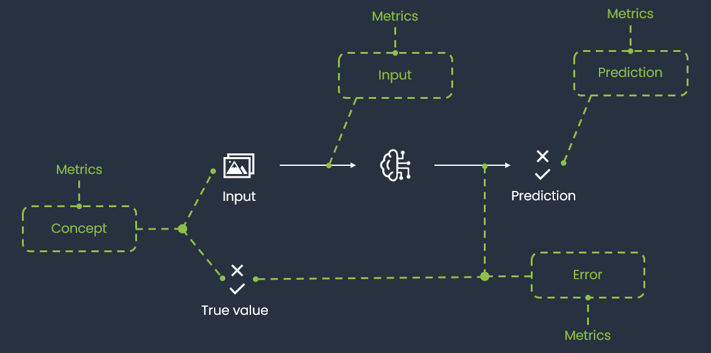
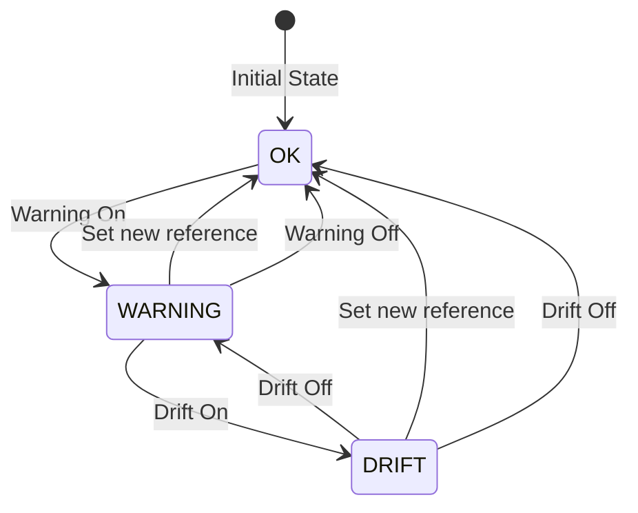

# Monitoring

The monitoring module is a key feature of the ML cube Platform. 
It enables continuous tracking of AI models performance over time, helping to identify potential issues. 
It also implements the monitoring of production data to preemptively detect distribution changes, ensuring
that the model continues to perform as expected and aligns with business requirements.

## Why do you need Monitoring?

Machine Learning algorithms are based on the assumption that the distribution of the data used for training is the same as the one from which
production data are drawn from. This assumption never holds in practice, as the real world is characterized by dynamic and ever-changing conditions.
These distributional changes, if not addressed properly, can cause a drop in the model's performance, leading to bad estimations or predictions, which
in turn can have a negative impact on the business.

Monitoring, also known as __Drift Detection__ in the literature, refers the process of continuously tracking the performance of a model 
and the distribution of the data it is operating on to identify significant changes.

## How does the ML cube Platform perform Monitoring?

The ML cube Platform performs monitoring by employing statistical techniques to compare a certain reference (for instance, data used for training or the 
performance of a model on the test set) to incoming production data. 

These statistical techniques, also known as _monitoring algorithms_, are tailored to the type of data
being observed; for instance, univariate data requires different monitoring techniques than multivariate data. 
However, you don't need to worry about
the specifics of these algorithms, as the ML cube Platform takes care of selecting the most appropriate ones for your [Task].

If a significant difference between reference and production data is detected, an alarm is raised, signaling that the monitored entity
is drifting away from the expected behavior and that corrective actions should be taken.

In practical terms, you can use the SDK to specify the time period where the reference of a given model should be placed.
As a consequence, all algorithms associated with the specified model (not just those monitoring the performance, but also those operating 
on the data used by the model) will
be initialized on the specified reference. Of course, you should provide to the 
Platform the data you want to use as a reference before setting the reference itself. This can be done through the SDK as well.

After setting the reference, you can send production data to the Platform, still using the SDK. This data will be analyzed by the monitoring algorithms
and, if a significant difference is detected, an alarm will be raised, in the form of a [Detection Event]. 
You can explore more about detection events and how you can set up automatic actions upon their reception in the Detection Event 
and the [Detection Event Rule] sections respectively.

### Targets and Metrics

After explaining why monitoring is so important in modern AI systems and detailing how it is performed in the ML cube Platform, 
we can introduce the concepts of Monitoring Targets and Monitoring Metrics. They both represent quantities that the ML cube Platform monitors, 
but they differ in their nature. The figure below provides an overview of how Monitoring Targets and Metrics are 
related to each other and to the entities of the Task.

<figure markdown style="width: 100%">
  
  <figcaption> Monitoring Targets and Metrics overview</figcaption>
</figure>

Monitoring Targets and Metrics are defined by the ML cube Platform based on the Task attributes, such as the Task Type and the Data Structure, 
and their monitoring is automatically enabled upon the Task creation. The idea underlying defining many entities to monitor, 
rather than monitoring only the model error, is to provide a comprehensive view of the model's
performance and the data distribution, easing the identification of the root causes of a drift and thus facilitating the corrective actions.


#### Monitoring Targets

A Monitoring Target is a relevant entity involved in a Task. They represent the main quantities monitored by the Platform, those whose
variation can have a significant impact on the AI task success. 

The ML cube Platform supports the following Monitoring Targets:


| Monitoring Target              | Description                                                                                                                                                      |
|--------------------------------|------------------------------------------------------------------------------------------------------------------------------------------------------------------|
| INPUT                          | the input distribution, $P(X)$.                                                                                                                                  |
| CONCEPT                        | the joint distribution of input and target, $P(X, Y)$.                                                                                                           |
| PREDICTION                     | the prediction of the model, $P(\hat{Y})$.                                                                                                                       |
| INPUT PREDICTION               | the joint distribution of input and prediction, $P(X, \hat{Y})$.                                                                                                 |
| ERROR                          | the error of the model, whose computation depends on the task type.                                                                                              |
| USER INPUT                     | the input provided by the user, usually in the form of a query. This target is only available in tasks of type RAG.                                              |
| USER INPUT RETRIEVED CONTEXT   | the similarity between the user input and the context retrieved by the RAG system. This target is only available in tasks of type RAG.                           |
| USER INPUT MODEL OUTPUT        | the similarity between the user input and the response of the Large Language Model. This target is only available in tasks of type RAG.                          |
| MODEL OUTPUT RETRIEVED CONTEXT | the similarity between the response of the Large Language Model and the context retrieved by the RAG system. This target is only available in tasks of type RAG. |
| CHARACTER ERROR RATE (CER)     | the normalized edit distance at the character level between the OCR output and the ground truth text (insertions, deletions, substitutions). Applicable only to OCR tasks. |
| WORD ERROR RATE (WER)          | the normalized edit distance at the word level between the OCR output and the ground truth text. Useful for evaluating readability and semantic accuracy in OCR tasks. |

As mentioned, some targets are available only for specific Task types. The following table shows all the available monitoring targets in relation with the Task Type. 
While some targets were specifically designed for a certain Task Type, others are more general and can be used in different contexts. 
Nonetheless, the Platform might not support yet all possible combinations. The table will be updated as new targets are added to the product.

| **Monitoring Target**          | **REGRESSION** | **CLASSIFICATION BINARY** | **CLASSIFICATION MULTICLASS** | **CLASSIFICATION MULTILABEL** | **OBJECT DETECTION** | **SEMANTIC SEGMENTATION** | **RAG** | **TIME SERIES** | **CLUSTERING** | **OCR** |
|--------------------------------|:--------------:|:-------------------------:|:-----------------------------:|:-----------------------------:|:--------------------:|:-------------------------:|:-------:|:---------------:|:--------------:|:-------:|
| INPUT                          | :material-check: | :material-check:          | :material-check:              | :material-check:              | :material-check:     | :material-check:          |         |                 | :material-check: | :material-check: |
| CONCEPT                        | :material-check: | :material-check:          | :material-check:              | :material-check:              |                      |                           |         |                 |                |         |
| PREDICTION                     | :material-check: | :material-check:          | :material-check:              |                               |                      |                           |         |                 | :material-check: |         |
| INPUT PREDICTION               | :material-check: | :material-check:          | :material-check:              |                               |                      |                           |         |                 | :material-check: |         |
| ERROR                          | :material-check: | :material-check:          | :material-check:              | :material-check:              |                      |                           |         | :material-check: |                |         |
| USER INPUT                     |                |                           |                               |                               |                      |                           | :material-check: |                 |                |         |
| USER INPUT RETRIEVED CONTEXT   |                |                           |                               |                               |                      |                           | :material-check: |                 |                |         |
| USER INPUT MODEL OUTPUT        |                |                           |                               |                               |                      |                           | :material-check: |                 |                |         |
| MODEL OUTPUT RETRIEVED CONTEXT |                |                           |                               |                               |                      |                           | :material-check: |                 |                |         |
| CHARACTER ERROR RATE (CER)     |                |                           |                               |                               |                      |                           |         |                 |                | :material-check: |
| WORD ERROR RATE (WER)          |                |                           |                               |                               |                      |                           |         |                 |                | :material-check: |

#### Monitoring Metrics

A Monitoring Metric is a generic quantity that can be computed on a Monitoring Target. They enable the monitoring of specific
aspects of an entity, which might help in identifying the root cause of a drift, as well as defining the corrective actions to be taken.

For certain Monitoring Metrics, the Platform includes a specification field that provides additional details about the Monitoring Metric. 
For example, in the Object Detection Task, the AVERAGE AREA PER OBJECT TYPE Monitoring Metric is not computed once for the entire Task but is calculated separately for each possible object type. 
The specification field indicates which object type a particular Monitoring Metric refers to, meaning there will be a distinct AVERAGE AREA PER OBJECT TYPE Monitoring Metric for each output label associated with the Task.
For other metrics, the specification represents the method used to compute it.
For example, the Image Contrast can be computed with different methods like Root Mean Square or Michelson.

The following table displays the Monitoring Metrics supported, along with their Monitoring Target and the conditions
under which they are actually computed and monitored. The possible values that each metric can assume are also provided.
Eventually, it is shown whether for each Monitoring Metric the specification is available and how it works.
This table is subject to changes, as new metrics will be added in the future.

| **Monitoring Metric** | Description | **Monitoring Target** | **Conditions** | **Possible values** | Specification |
|----------------------|-------------|----------------------|----------------|---------------------|---------------|
| TEXT TOXICITY | The toxicity of the text | INPUT, USER INPUT, PREDICTION | When the data structure is text | Either _neutral_ or _toxic_. | |
| TEXT EMOTION | The emotion of the text | INPUT, USER INPUT | When the data structure is text | If the Task text language is Italian, one between these: _anger_, _joy_, _sadness_, _fear_.<br/><br/>Otherwise, one between these: _admiration_, _amusement_, _anger_, _annoyance_, _approval_, _caring_, _confusion_, _curiosity_, _desire_, _disappointment_, _disapproval_, _disgust_, _embarrassment_, _excitement_, _fear_, _gratitude_, _grief_, _joy_, _love_, _nervousness_, _optimism_, _pride_, _realization_, _relief_, _remorse_, _sadness_, _surprise_, _neutral_. | |
| TEXT SENTIMENT | The sentiment of the text | INPUT, USER INPUT | When the data structure is text | If the Task text language is Italian, one between these: _POSITIVE_, _NEGATIVE_. Otherwise, one between these: _negative_, _neutral_, _positive_ | |
| TEXT LENGTH | The length of the text | INPUT, USER INPUT, RETRIEVED CONTEXT, PREDICTION | When the data structure is text | An integer value in the range of $[0, \infty]$ | |
| MODEL PERPLEXITY | A measure of the uncertainty of an LLM when predicting the next words | PREDICTION | When the task type is RAG | A floating point value. | |
| MODEL ENTROPY | Computes the entropy of the Gaussian predictive distribution of the model | PREDICTION PROBABILITY | When the model outputs a probabilistic (Gaussian) prediction | A floating point value. | |
| MODEL IMAGE ENTROPY | Uncertainty of the model predicting objects in the images | PREDICTION PROBABILITY | When Task Type is Object Detection or Semantic Segmentation | A floating point value. | |
| LOG LIKELIHOOD | Computes the log-likelihood of the Gaussian predictive distribution of the model | ERROR | When the model outputs a probabilistic (Gaussian) prediction | A floating point value. | |
| IMAGE BRIGHTNESS | The brightness of the image measured as the average value of the pixel intensities in the gray scaled image | INPUT | When the data structure is image | A floating point value in the range $[0, 255]$, where 0 is completely dark and 255 completely white | |
| IMAGE CONTRAST | The contrast of the image computed on the gray scaled image using methods such as RMS, Michelson, Histogram Spread or Histogram Flatness | INPUT | When the data structure is image | A floating point value, range depends on the method used | Method to extract contrast |
| IMAGE FOCUS | The focus of the image computed as the Laplacian of the gray scaled image | INPUT | When the data structure is image | A floating point value in $[0, \infty]$; higher means sharper image | |
| IMAGE BLUR | The blur level of the image computed from the gray scaled image | INPUT | When the data structure is image | A floating point value in $[0, 1]$, where 0 is sharp and 1 is fully blurred | |
| IMAGE COLOR CONTRAST RED | Contrast computed on the red channel | INPUT | When the data structure is image | A floating point value, range depends on method | Method to extract contrast |
| IMAGE COLOR CONTRAST GREEN | Contrast computed on the green channel | INPUT | When the data structure is image | A floating point value, range depends on method | Method to extract contrast |
| IMAGE COLOR CONTRAST BLUE | Contrast computed on the blue channel | INPUT | When the data structure is image | A floating point value, range depends on method | Method to extract contrast |
| IMAGE COLOR VARIATION RED | Color variation of the red channel | INPUT | When the data structure is image and mode is RGB/RGBA | A one-dimensional floating point array | |
| IMAGE COLOR VARIATION GREEN | Color variation of the green channel | INPUT | When the data structure is image and mode is RGB/RGBA | A one-dimensional floating point array | |
| IMAGE COLOR VARIATION BLUE | Color variation of the blue channel | INPUT | When the data structure is image and mode is RGB/RGBA | A one-dimensional floating point array | |
| AVERAGE AREA PER OBJECT TYPE | Average area of identified objects of the same type; missing if no objects of that type are present | PREDICTION | When Task Type is Object Detection or Semantic Segmentation | A floating point value | One metric per output label |
| QUANTITY PER OBJECT TYPE | Number of identified objects per type | PREDICTION | When Task Type is Object Detection or Semantic Segmentation | A one-dimensional integer array | One metric per output label |
| TOTAL OBJECTS | Total number of identified objects | PREDICTION | When Task Type is Object Detection or Semantic Segmentation | An integer value | |
| OBJECT TYPES COUNT | Number of different object types identified | PREDICTION | When Task Type is Object Detection or Semantic Segmentation | An integer value | |
| TRACKING OBJECT POSITION | Polar coordinates (distance, cos-angle, sin-angle) of the farthest object from the image center | PREDICTION | When Task Type is Object Detection or Semantic Segmentation | A one-dimensional array | |

##### Contrast Methods

There are different definitions of image contrast each for specific visual aspects.
Here we describe the methods available in ML cube Platform:

- **RMS: Root Mean Square:** contrast does not depend on the spatial frequency content or the spatial distribution of contrast in the image. RMS contrast is defined as the standard deviation of the pixel intensities:
$$
\sqrt{\frac{1}{MN} \sum_{i=0}^{N-1} \sum_{j=0}^{M-1} (I_{ij} - \bar{I})^2}
$$
where intensities $I_{ij}$ are the $i$-th $j$-th element of the two-dimensional image of size $M$ by $N$. $\bar {I}$ is the average intensity of all pixel values in the image.

- **Michelson:** Michelson contrast is commonly used for patterns where both bright and dark features are equivalent and take up similar fractions of the area. The Michelson contrast is defined as:
$$
\frac{I_{max} -I_{min}}{I_{max} + I_{min}}
$$
where $I_{max}$ and $I_{min}$ are the maximum and minimum intensities of the gray scaled image.
In ML cube Platform we use a more slightly different version of this formula where instead of the minimum and maximum, 10-th and 90-th percentiles are used.

- **Histogram Spread:** is the ratio between the quartile distance to the range of the histogram and the range of intensities.
The third and first quartiles are the histogram bins at which the cumulative histogram has 75% and 25% of maximum value:
$$
\frac{q_3 -q_1}{I_{max} + I_{min}}
$$

- **Histogram Flatness:** is the ratio of the geometric mean to the arithmetic mean of the histogram counts:

$$
\frac{\sqrt[n]{\prod_{i}^{n} x_i} }{\frac{1}{n}\sum_{i}^n x_i}
$$
for low contrast images this metric is lower than for high contrast images.

### Monitoring Evaluation Metrics

While Monitoring Targets and Monitoring Metrics track distributional aspects of data and model outputs, **Monitoring Evaluation Metrics** measure the actual predictive performance of a model on production data. These are computed whenever ground truth labels become available for production samples, allowing the platform to continuously assess whether a model's accuracy has degraded over time.

The evaluation is straightforward: for each time window in which labeled production data is available, the platform computes the configured evaluation metric and compares the result against a threshold. If the value crosses that threshold, a [Detection Event] is raised, signaling a potential degradation in model quality.

The evaluation metrics available depend on the Task Type. The following subsections describe the metrics supported for each relevant task type.

#### Classification

The following evaluation metrics are available for Binary and Multiclass Classification tasks:

| Evaluation Metric | Description | Possible values |
|---|---|---|
| ACCURACY | Fraction of correctly classified samples over the total | A floating point value in $[0, 1]$ |
| BALANCED ACCURACY | Average recall over all classes, accounting for class imbalance | A floating point value in $[0, 1]$ |
| PRECISION | Fraction of true positives over predicted positives | A floating point value in $[0, 1]$ |
| RECALL | Fraction of true positives over actual positives | A floating point value in $[0, 1]$ |
| F1 | Harmonic mean of Precision and Recall | A floating point value in $[0, 1]$ |
| ROC AUC | Area under the Receiver Operating Characteristic curve | A floating point value in $[0, 1]$ |
| PR AUC | Area under the Precision-Recall curve | A floating point value in $[0, 1]$ |
| LOG LOSS | Negative log-likelihood of the predicted probabilities | A floating point value in $[0, \infty]$; lower is better |
| FPR AT TPR | False Positive Rate at a fixed True Positive Rate level | A floating point value in $[0, 1]$ |

For Multilabel Classification, the supported evaluation metrics are:

- Accuracy  
- Precision  
- Recall  
- F1 score  

These metrics are computed using **macro-averaging across labels**, where each label is evaluated independently and the final score is obtained by taking the unweighted mean over all labels.

The **Accuracy** metric in this context corresponds to **subset accuracy**, meaning a prediction is considered correct only if all labels for a given sample match exactly.

#### Regression

The following evaluation metrics are available for Regression tasks:

| Evaluation Metric | Description | Possible values |
|---|---|---|
| RMSE | Root Mean Square Error between predictions and ground truth | A floating point value in $[0, \infty]$; lower is better |
| MAE | Mean Absolute Error between predictions and ground truth | A floating point value in $[0, \infty]$; lower is better |
| MAPE | Mean Absolute Percentage Error, expressed as a fraction | A floating point value in $[0, \infty]$; lower is better |
| R SQUARED | Coefficient of determination; proportion of variance explained by the model | A floating point value, typically in $(−\infty, 1]$; higher is better |

<!--

#### Clustering

The following evaluation metrics are available for Clustering tasks:

| Evaluation Metric | Description | Requires ground truth labels | Possible values |
|---|---|---|---|
| ADJUSTED RAND INDEX | Measures similarity between predicted clusters and ground truth assignments, corrected for chance | Yes | A floating point value in $[−1, 1]$; higher is better |
| V MEASURE | Harmonic mean of homogeneity and completeness of the clustering | Yes | A floating point value in $[0, 1]$ |
| NMI | Normalized Mutual Information between predicted and true cluster assignments | Yes | A floating point value in $[0, 1]$ |
| SILHOUETTE | Measures how well each sample fits its assigned cluster relative to neighboring clusters | No | A floating point value in $[−1, 1]$; higher is better |
| CALINSKI HARABASZ | Ratio of between-cluster dispersion to within-cluster dispersion | No | A floating point value in $[0, \infty]$; higher is better |

Note that some clustering metrics (Silhouette and Calinski-Harabasz) do not require ground truth labels and can therefore be computed continuously on production data, while label-dependent metrics (Adjusted Rand Index, V Measure, NMI) are only computed when ground truth cluster assignments are available.  -->

#### Threshold-based evaluation

For all task types, performance evaluation works by comparing the computed metric value against a user-defined threshold. If the metric crosses this threshold — either falling below it for quality metrics like Accuracy or exceeding it for error metrics like RMSE — a [Detection Event] is raised, signaling that model performance has degraded to a level requiring attention.

<!-- The threshold can be configured via the SDK when setting up or updating a model's monitoring configuration. Setting a meaningful threshold is important: a threshold that is too strict will trigger false alarms, while one that is too lenient may fail to catch meaningful regressions. -->

### Monitoring Status

All the entities being monitored are associated with a status, which can be one of the following:

| Status  | Description                                                                             | 
|---------|-----------------------------------------------------------------------------------------|
| OK      | the entity is behaving as expected.                                                     |
| WARNING | the entity has shown signs of drifts, but it is still within the acceptable range.      |
| DRIFT   | the entity has experienced a significant change and corrective actions should be taken. |


The following state diagram illustrates the possible transitions between the statuses, as well as the events that trigger them.


```mermaid
stateDiagram-v2
    
    [*] --> OK : Initial State
    
    OK --> WARNING : Warning On
    WARNING --> OK : Set new reference 
    WARNING --> OK : Warning Off
    
    
    WARNING --> DRIFT : Drift On
    DRIFT --> WARNING : Drift Off
    
    DRIFT --> OK : Set new reference
    DRIFT --> OK : Drift Off
```


Notice that a Drift Off event can either bring the entity back to the `OK` status or to the `WARNING` status, 
depending on the velocity and intensity of the change and the monitoring algorithm's sensitivity. The same applies
to the Drift On events, which can both occur when the entity is in the `WARNING` status or in the `OK` status.

The only transitions which are not due to Detection Events are the ones caused by the specification of a new reference. 
In this case, the status of the entity is reset to `OK`
for every entity as all the monitoring algorithms are reinitialized on the new reference.

You can check the status of the monitored entities both through the WebApp and the SDK. In particular, the homepage of the Task 
displays the status of both monitoring targets and metrics, while the SDK provides a couple of methods to 
retrieve the status of the monitored entities programmatically.

??? code-block "SDK Example"

    You can visualize the status of a Monitoring Target using the 
    `get_monitoring_status` method of the `Client` object:

    ``` py
    status = client.get_monitoring_status(
        task_id=task_id, 
        monitoring_target=MonitoringTarget.INPUT,
    )
    ```
    
    In the same way, you can retrieve the status of a Monitoring Metric:

    ``` py
    status = client.get_monitoring_status(
        task_id=task_id, 
        monitoring_target=MonitoringTarget.USER_INPUT,
        monitoring_metric=MonitoringMetric.TEXT_TOXICITY,
    )
    ```
    
    The method returns a BaseModel of type `MonitoringQuantityStatus` that contains the status of the 
    specified monitoring entity.


[Task]: ../task.md
[Detection Event Rule]: detection_event_rules.md
[Detection Event]: detection_event.md
[get_task]: ../../api/python/client.md#get_task