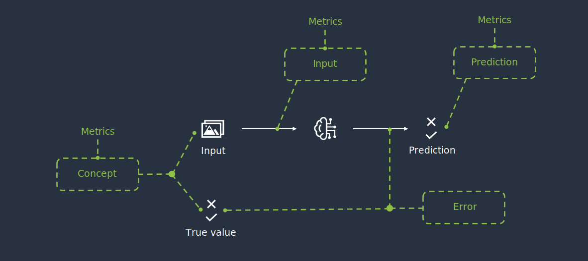

# Monitoring

The monitoring module is a key feature of the ML cube Platform. 
It enables continuous tracking of AI models performance over time, helping to identify potential issues. 
It also implements the monitoring of production data to preemptively detect distribution changes, ensuring
that the model continues to perform as expected and aligns with business requirements.

## Why do you need Monitoring?

Machine Learning algorithms are based on the assumption that the distribution of the data used for training is the same as the one from which
production data are drawn from. This assumption never holds in practice, as the real world is characterized by dynamic and ever-changing conditions.
These distributional changes, if not addressed properly, can cause a drop in the model's performance, leading to bad estimations or predictions, which
in turn can have a negative impact on the business.

Monitoring, also known as __Drift Detection__ in the literature, refers the process of continuously tracking the performance of a model 
and the distribution of the data it is operating on to identify significant changes.

## How does the ML cube Platform perform Monitoring?

The ML cube platform performs monitoring by employing statistical techniques to compare a certain reference (for instance, data used for training or the 
performance of a model on the test set) to incoming production data. 

These statistical techniques, also known as _monitoring algorithms_, are tailored to the type of data
being observed; for instance, univariate data requires different monitoring techniques than multivariate data. 
However, you don't need to worry about
the specifics of these algorithms, as the ML cube Platform takes care of selecting the most appropriate ones for your [Task].

If a significant difference between reference and production data is detected, an alarm is raised, signaling that the monitored entity
is drifting away from the expected behavior and that corrective actions should be taken.

In practical terms, you can use the SDK to specify the time period where the reference of a given model should be placed.
As a consequence, all algorithms associated with the specified model (not just those monitoring the performance, but also those operating 
on the data used by the model) will
be initialized on the specified reference. Of course, you should provide to the 
Platform the data you want to use as a reference before setting the reference itself. This can be done through the SDK as well.

After setting the reference, you can send production data to the platform, still using the SDK. This data will be analyzed by the monitoring algorithms
and, if a significant difference is detected, an alarm will be raised, in the form of a [Detection Event]. 
You can explore more about detection events and how you can set up automatic actions upon their reception in the Detection Event 
and the [Detection Event Rule] sections respectively.

### Targets and Metrics

After explaining why monitoring is so important in modern AI systems and detailing how it is performed in the ML cube Platform, 
we can introduce the concepts of Monitoring Targets and Monitoring Metrics. They both represent quantities that the ML cube Platform monitors, 
but they differ in their nature. The figure below provides an overview of how Monitoring Targets and Metrics are 
related to each other and to the entities of the Task.

<figure markdown style="width: 100%">
  
  <figcaption> Monitoring Targets and Metrics overview</figcaption>
</figure>

Monitoring Targets and Metrics are defined by the ML cube platform based on the Task attributes, such as the Task Type and the Data Structure, 
and their monitoring is automatically enabled upon the Task creation. The idea underlying defining many entities to monitor, 
rather than monitoring only the model error, is to provide a comprehensive view of the model's
performance and the data distribution, easing the identification of the root causes of a drift and thus facilitating the corrective actions.


#### Monitoring Targets

A Monitoring Target is a relevant entity involved in a Task. They represent the main quantities monitored by the platform, those whose
variation can have a significant impact on the AI task success. 

The ML cube platform supports the following monitoring targets:


| Monitoring Target              | Description                                                                                                                                                      | 
|--------------------------------|------------------------------------------------------------------------------------------------------------------------------------------------------------------|
| INPUT                          | the input distribution, $P(X)$.                                                                                                                                  | 
| CONCEPT                        | the joint distribution of input and target, $P(X, Y)$.                                                                                                           | 
| PREDICTION                     | the prediction of the model, $P(\hat{Y})$.                                                                                                                       | 
| INPUT PREDICTION               | the joint distribution of input and prediction, $P(X, \hat{Y})$.                                                                                                 | 
| ERROR                          | the error of the model, whose computation depends on the task type.                                                                                              | 
| USER INPUT                     | the input provided by the user, usually in the form of a query. This target is only available in tasks of type RAG.                                              |
| USER INPUT RETRIEVED CONTEXT   | the similarity between the user input and the context retrieved by the RAG system. This target is only available in tasks of type RAG.                           |
| USER INPUT MODEL OUTPUT        | the similarity between the user input and the response of the Large Language Model. This target is only available in tasks of type RAG.                          |
| MODEL OUTPUT RETRIEVED CONTEXT | the similarity between the response of the Large Language Model and the context retrieved by the RAG system. This target is only available in tasks of type RAG. |

As mentioned, some targets are available only for specific Task types. The following table shows all the available monitoring targets in relation with the Task Type. 
While some targets were specifically designed for a certain Task Type, others are more general and can be used in different contexts. 
Nonetheless, the platform might not support yet all possible combinations. The table will be updated as new targets are added to the product.

| **Monitoring Target**          |  **REGRESSION**  | **CLASSIFICATION BINARY** | **CLASSIFICATION MULTICLASS** | **CLASSIFICATION MULTILABEL** | **OBJECT DETECTION** | **SEMANTIC SEGMENTATION** |     **RAG**      |
|--------------------------------|:----------------:|:-------------------------:|:-----------------------------:|:-----------------------------:|:--------------------:|:--------------------:|:----------------:|
| INPUT                          | :material-check: |     :material-check:      |       :material-check:        |       :material-check:        |   :material-check:   |   :material-check:   |                  |
| CONCEPT                        | :material-check: |     :material-check:      |       :material-check:        |       :material-check:        |                      |                      |                  |
| PREDICTION                     | :material-check: |     :material-check:      |       :material-check:        |                               |                      |                      |                  |
| INPUT PREDICTION               | :material-check: |     :material-check:      |       :material-check:        |                               |                      |                      |                  |
| ERROR                          | :material-check: |     :material-check:      |       :material-check:        |       :material-check:        |                      |                      |                  |
| USER INPUT                     |                  |                           |                               |                               |                      |                      | :material-check: |
| USER INPUT RETRIEVED CONTEXT   |                  |                           |                               |                               |                      |                      | :material-check: |
| USER INPUT MODEL OUTPUT        |                  |                           |                               |                               |                      |                      | :material-check: |
| MODEL OUTPUT RETRIEVED CONTEXT |                  |                           |                               |                               |                      |                      | :material-check: |

#### Monitoring Metrics

A Monitoring Metric is a generic quantity that can be computed on a Monitoring Target. They enable the monitoring of specific
aspects of an entity, which might help in identifying the root cause of a drift, as well as defining the corrective actions to be taken.

The following table displays the Monitoring Metrics supported, along with their Monitoring Target and the conditions
under which they are actually computed and monitored. The possible values that each metric can assume are also provided.
This table is subject to changes, as new metrics will be added in the future.

| **Monitoring Metric** | Description                                                           |              **Monitoring Target**               |             **Conditions**             | **Possible values**                                                                                                                                                                                                                                                                                                                                                                                                                                                                  |
|:---------------------:|-----------------------------------------------------------------------|:------------------------------------------------:|:--------------------------------------:|:-------------------------------------------------------------------------------------------------------------------------------------------------------------------------------------------------------------------------------------------------------------------------------------------------------------------------------------------------------------------------------------------------------------------------------------------------------------------------------------|
|     TEXT TOXICITY     | The toxicity of the text                                              |          INPUT, USER INPUT, PREDICTION           |    When the data structure is text     | Either _neutral_ or _toxic_.                                                                                                                                                                                                                                                                                                                                                                                                                                                         |
|     TEXT EMOTION      | The emotion of the text                                               |                INPUT, USER INPUT                 |    When the data structure is text     | If the Task text language is Italian, one between these: _anger_, _joy_, _sadness_, _fear_. <br/> <br/> Otherwise, _one_ between these: _admiration_, _amusement_, _anger_, _annoyance_, _approval_, _caring_, _confusion_, _curiosity_, _desire_, _disappointment_, _disapproval_, _disgust_, _embarrassment_, _excitement_, _fear_, _gratitude_, _grief_, _joy_, _love_, _nervousness_, _optimism_, _pride_, _realization_, _relief_, _remorse_, _sadness_, _surprise_, _neutral_. |
|    TEXT SENTIMENT     | The sentiment of the text                                             |                INPUT, USER INPUT                 |    When the data structure is text     | If the Task text language is Italian, one between these: _POSITIVE_, _NEGATIVE_. Otherwise, one between these: _negative_, _neutral_, _positive_                                                                                                                                                                                                                                                                                                                                     |
|      TEXT LENGTH      | The length of the text                                                | INPUT, USER INPUT, RETRIEVED CONTEXT, PREDICTION |    When the data structure is text     | An integer value.                                                                                                                                                                                                                                                                                                                                                                                                                                                                    |
|   MODEL PERPLEXITY    | A measure of the uncertainty of an LLM when predicting the next words |                    PREDICTION                    |       When the task type is RAG        | A floating point value.                                                                                                                                                                                                                                                                                                                                                                                                                                                              |
|   IMAGE BRIGHTNESS    | The brightness of the image                                           |                      INPUT                       |    When the data structure is image    | A floating point value.                                                                                                                                                                                                                                                                                                                                                                                                                                                              |
|    IMAGE CONTRAST     | The contrast of the image                                             |                      INPUT                       |    When the data structure is image    | A floating point value.                                                                                                                                                                                                                                                                                                                                                                                                                                                              |
|    IMAGE FOCUS     | The focus of the image                                             |                      INPUT                       |    When the data structure is image    | A floating point value.                                                                                                                                                                                                                                                                                                                                                                                                                                                              |
|    IMAGE COLOR VARIATION RED    | The color variation of the red channel of the image    |                      INPUT                       |    When the data structure is image and the image mode is either RGB or RGBA    | An array with one dimension.                                                                                                                                                                                                                                                                                                                                                                                                                                                               |
|    IMAGE COLOR VARIATION GREEN    | The color variation ofthe green channel of the image    |                      INPUT                       |    When the data structure is image and the image mode is either RGB or RGBA    | An array with one dimension.                                                                                                                                                                                                                                                                                                                                                                                                                                                              |
|    IMAGE COLOR VARIATION BLUE   | The color variation of the blue channel of the image    |                      INPUT                       |    When the data structure is image and the image mode is either RGB or RGBA    | An array with one dimension.                                                                                                                                                                                                                                                                                                                                                                                                                                                              |
| AVERAGE AREA PER OBJECT TYPE | Average area of identified objects of the same type. If a sample does not have labels of that type then this metric is missing. | PREDICTION | When Task Type is Object Detection or Semantic Segmentation | A floating point |
| QUANTITY PER OBJECT TYPE | Number of identified objects for each type in the image. | PREDICTION | When Task Type is Object Detection or Semantic Segmentation | A array with one dimensions. Each element corresponds to an object label. |
| TOTAL OBJECTS | Total number of identified objects independently from the object type. | PREDICTION | When Task Type is Object Detection or Semantic Segmentation | A floating point |
| OBJECT TYPES COUNT | Number of different object types identified in the image. It differs from the other because it only counts the number of different labels and not the number of objects per labels or objects in total. | PREDICTION | When Task Type is Object Detection or Semantic Segmentation | A floating point |
| MODEL ENTROPY | Uncertainty of the model predicting objects in the images | PREDICTION PROBABILITY | When Task Type is Object Detection or Semantic Segmentation | A floating point |


### Monitoring Status

All the entities being monitored are associated with a status, which can be one of the following:

| Status  | Description                                                                             | 
|---------|-----------------------------------------------------------------------------------------|
| OK      | the entity is behaving as expected.                                                     |
| WARNING | the entity has shown signs of drifts, but it is still within the acceptable range.      |
| DRIFT   | the entity has experienced a significant change and corrective actions should be taken. |


The following state diagram illustrates the possible transitions between the statuses, as well as the events that trigger them.


Notice that a Drift Off event can either bring the entity back to the `OK` status or to the `WARNING` status, 
depending on the velocity and intensity of the change and the monitoring algorithm's sensitivity. The same applies
to the Drift On events, which can both occur when the entity is in the `WARNING` status or in the `OK` status.

The only transitions which are not due to Detection Events are the ones caused by the specification of a new reference. 
In this case, the status of the entity is reset to `OK`
for every entity as all the monitoring algorithms are reinitialized on the new reference.

You can check the status of the monitored entities both through the WebApp and the SDK. In particular, the homepage of the Task 
displays the status of both monitoring targets and metrics, while the SDK provides a couple of methods to 
retrieve the status of the monitored entities programmatically.

??? code-block "SDK Example"

    You can visualize the status of a Monitoring Target using the 
    `get_monitoring_status` method of the `Client` object:

    ``` py
    status = client.get_monitoring_status(
        task_id=task_id, 
        monitoring_target=MonitoringTarget.INPUT,
    )
    ```
    
    In the same way, you can retrieve the status of a Monitoring Metric:

    ``` py
    status = client.get_monitoring_status(
        task_id=task_id, 
        monitoring_target=MonitoringTarget.USER_INPUT,
        monitoring_metric=MonitoringMetric.TEXT_TOXICITY,
    )
    ```
    
    The method returns a BaseModel of type `MonitoringQuantityStatus` that contains the status of the 
    specified monitoring entity.


[Task]: ../task.md
[Detection Event Rule]: detection_event_rules.md
[Detection Event]: detection_event.md
[get_task]: ../../api/python/client.md#get_task