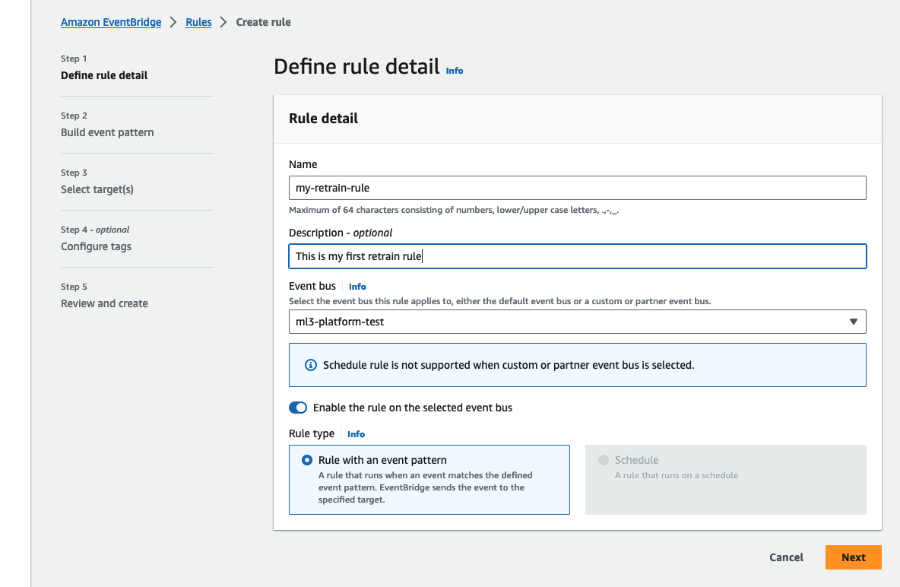
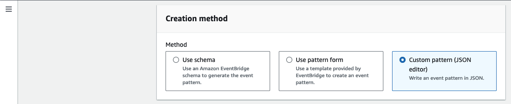

This section provides an overview of how you can setup retrain triggers for your models so that you can automatically start your retraining pipeline from ML cube Platform.
A retrain trigger can be used inside a Detection Event Rule that when specific criteria are met automatically computes the retrain report and then push the trigger, or in the retraining tool page where you can manually push the trigger for the model.

A retrain trigger is modelled as an integration to an external service and requires credentials with the right privileges to perform the action.

## Supported Triggers

The following retrain triggers are supported:

- `AWS Event Bridge`: creates an event to Event Bus with specific metadata.

### AWS Event Bridge

If you have your MLOps pipelines inside AWS ecosystem then you probably need the AWS Event Bridge retrain trigger.
The trigger consists in creating an event in a Event Bus of your AWS account with custom metadata.
You need to create an Event Bus rule that recognises the right the ML cube Platform pattern and attach the target action you want.
Examples of targets are:

- launching a Lambda function;
- launching a SageMaker pipeline;
- sending a message to a SQS Queue with a retraining request.

#### Event Bus Setup

1. From AWS console open the EventBridge service and on the left menu select the voice `Event buses`
    <figure markdown>
    { width="800" }
    </figure>
2. In the `Custom event bus` tab create a new event bus

3. Select the `Rules` section on the left menu and click the button `Create Rule`
    <figure markdown>
    { width="800" }
    </figure>
4. Insert the rule name and in the Event Bus section the created Event Bus. Click `Next`
    1. `Event source`: select the voice *AWS events or EventBridge patner events*
    <figure markdown>
    { width="800" }
    </figure>
    2. `Sample event`: copy and paste this:
```json
{
    "version": "0",
    "id": "fcdd87c7-f56e-c722-4f85-4cb6ba85a00a",
    "detail-type": "retrain_trigger",
    "source": "ml3_platform",
    "account": "123456789",
    "time": "2023-11-02T14:16:23Z",
    "region": "eu-west-3",
    "resources": [],
    "detail": {
        "first_param": "hi",
        "second_param": "bye"
    }
}
```
    <figure markdown>
    { width="800" }
    </figure>
    3. `Creation method`: select Custom pattern (JSON editor)
    <figure markdown>
    { width="800" }
    </figure>
    4. `Event pattern`: copy and paste this:
    <figure markdown>
    { width="800" }
    </figure>
    ```json
    {
        "source": [{
            "prefix": "ml3_platform"
        }],
        "detail-type": [{
            "prefix": "retrain_trigger"
        }]
    }
    ```
    5. click the button Test pattern to check the match and then click next

5. Select the target you want to start. If you want to test the rule, you can add a CloudWatch target that stores the event to a new Log Group.
    <figure markdown>
    { width="800" }
    </figure>
6. Create the rule

**Create AWS Credentials**
    
To integrate Amazon Event Bridge, you will need to create a set of AWS credentials.
Before doing this, you need to create an **IAM Role** in your AWS Account that will be used by the ML cube Platform to send events to your Event Bridge Event Bus.

First of all, log into your AWS account and open the AWS console.
Here, go to the **IAM** service, then navigate to the **Policies** section.
Here, we will create an **IAM Policy**.

!!! example
    The following policy will allow read access to objects in the `my-company-data-bucket` to the IAM entity it is attached to.

    ```json
    {
        "Version": "2012-10-17",
        "Statement": [
            {
                "Sid": "Statement1",
                "Effect": "Allow",
                "Action": [
                    "events:PutEvents"
                ],
                "Resource": [
                    "arn:aws:events:<REGION>:<ACCOUNT_ID>:event-bus/<EVENT_BUS_NAME>"
                ]
            }
        ]
    }
    ```

Once the **IAM Policy** has been created, navigate to the **Roles** section and create a new role. When asked, select the `Custom trust policy` option and paste the following json.
```json
{
    "Version": "2012-10-17",
    "Statement": [
        {
            "Sid": "Statement1",
            "Effect": "Allow",
            "Principal": {
                "AWS": "arn:aws:iam::883313729965:root"
            },
            "Action": "sts:AssumeRole",
            "Condition": {
                "StringEquals": {
                    "sts:ExternalId": "<EXTERNAL_ID>"
                }
            }
        }
    ]
}
```
We will populate the value of `EXTERNAL_ID` after creating the credentials entity on ML cube Platform.
Then, assign the **IAM Policy** we created previously to the role, so any entity that assumes the role will be able to put events on the Event Bus.

Now, you will need to create the credentials through the ML cube Platform SDK.

!!! example
    The following code will create a set of AWS credentials from the IAM Role we just created.

    ```py
    aws_creds = client.create_aws_integration_credentials(
        name='AWS_01',
        default=True,  # Set these credentials as the default to use when not specified
        project_id='your_project_id',
        role_arn='arn:aws:iam::{{YOUR_AWS_ACCOUNT_ID}}:role/{{YOUR_ROLE_NAME}}',
    )

    trust_policy = aws_creds.generate_trust_policy()
    print(trust_policy)
    ```

You can call the `generate_trust_policy` function on the created credentials to obtain the **trust policy**.
Edit your IAM Role and change the **trust policy** to the one you just obtained.